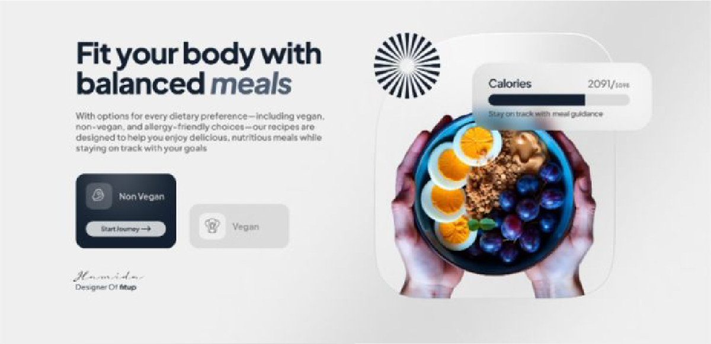

# 📊 Spesifikasi: ExalviaFact

Section ini menyajikan fakta atau data krusial untuk memperkuat urgensi layanan Anda di mata calon klien.

**Implementasi:** [ExalviaFact.js](../../sections/ExalviaFact.js)

---

## 🏗️ Tata Letak & Perilaku (Layout & Behavior)

- **Grid System:**
  - **Desktop:** Layout 2-kolom (`grid-cols-2`).
  - **Mobile:** Layout tumpuk (`flex-col`).
- **Container Size:** `lg:w-10/12 sm:w-11/12 w-full mx-auto`.
- **Vertical Alignment:** Rata tengah (`items-center`).
- **Architectural Style:** Menggunakan padding luas (`py-20 md:py-32`) untuk memberikan kesan premium dan udara untuk bernapas.

---

## 🍱 Struktur Konten (Fact Section Structure)

Data diambil dari objek `fact` di `ExalviaDatabase.js`:

### 1. Kolom Kiri: Narasi & Bukti

- **Badge:** Menggunakan `ExalviaBadge` dengan teks `data.label`.
- **Headline:** Menggunakan `ExalviaHeadline` dengan teks `data.title`.
- **Description:** Menggunakan `ExalviaBodyText` dengan teks `data.description`.
- **Feature Cards:**
  - Loop dari `data.items`.
  - Tampilkan sebagai kartu kecil berdampingan atau menumpuk.
  - Setiap kartu berisi Ikon dan Judul singkat (misal: "Meningkatkan Trust").
  - Gaya kartu: Bersih, border tipis, latar belakang putih/transparan.

### 2. Kolom Kanan: Visual Komposisi

- **Main Image:** Menggunakan `ExalviaImage` dengan `data.image`.
- **Decorative Base:** Gunakan bentuk geometris atau pola Arabesque di belakang gambar untuk menambah kedalaman visual.
- **Floating Element:** Tambahkan satu elemen visual kecil (misal: kartu statistik kecil atau badge mengambang) di atas gambar utama untuk menciptakan efek 3D.
- **Rounding:** Gambar utama harus memiliki rounding yang konsisten dengan gaya desain (`rounded-2xl` atau `rounded-bl-4xl`).

---

## 🛠️ Instruksi Teknis untuk AI

1.  **Atomic Integration:** Wajib menggunakan setidaknya 3 komponen atomik (`ExalviaBadge`, `ExalviaHeadline`, `ExalviaBodyText`).
2.  **No Blur Policy:** Gunakan gradasi solid atau overlay warna murni untuk elemen dekoratif. Dilarang menggunakan filter blur.
3.  **Responsive Spacing:** Pastikan jarak antara teks dan visual pada mobile memiliki gap yang cukup (`gap-12`).
4.  **Database Binding:** Hubungkan semua elemen (Badge, Judul, Deskripsi, Gambar) langsung ke objek `fact` di database.

---

## 📸 Referensi Visual

