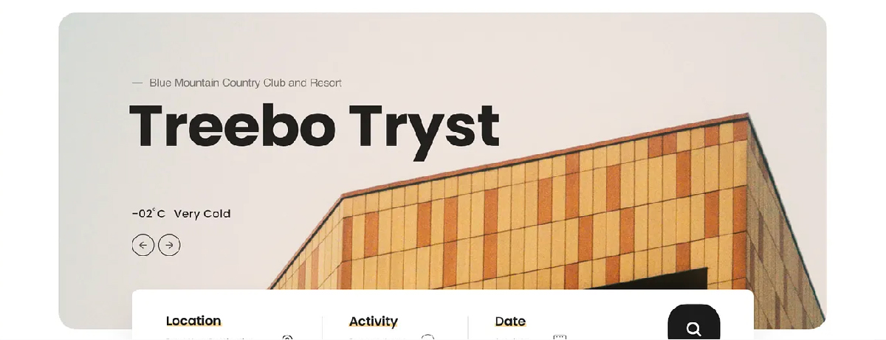

# 🎭 Spesifikasi: ExalviaHero

Bagian pertama yang dilihat pengguna (Above the Fold). Dirancang untuk memberikan dampak visual yang kuat dengan tata letak arsitektural yang elegan dan rata kiri.

**Implementasi:** [ExalviaHero.js](../../sections/ExalviaHero.js)

---

## 🏗️ Tata Letak & Perilaku (Layout & Behavior)

- **Lebar Kontainer Luar:** `w-full` (Full Width).
- **Lebar Kontainer Dalam:** `lg:w-10/12 sm:w-11/12 w-full mx-auto` (Centered with architectural rounding).
- **Rounding:** Menggunakan `rounded-bl-4xl` pada kontainer utama.
- **Tinggi:** Minimal **100vh** (satu layar penuh).
- **Posisi Konten:** **Rata Kiri** (Left Aligned), dirancang untuk membiarkan sisi kanan tetap terbuka agar visual latar belakang terlihat jelas.
- **Latar Belakang:**
  - Menggunakan gambar berkualitas tinggi dari `data.backgroundImage`.
  - **Overlay:** Wajib menggunakan gradien linear dari kiri ke kanan (`from-black/95 via-black/60 to-transparent`) untuk memastikan keterbacaan teks di sisi kiri.
  - **No Blur:** Dilarang menggunakan efek blur atau backdrop filter.

---

## 🍱 Struktur Konten (Hero Content)

Diambil dari objek `hero` di `ExalviaDatabase.js`:

1.  **Minimalist Badge:** Label kecil dengan aksen garis emas (`text-warning`) di atas headline.
2.  **Headline (H1):**
    - Menggunakan komponen `ExalviaHeadline`.
    - Tipografi: `Instrument Serif`.
    - Warna: Putih (`text-white`).
3.  **Subheadline:**
    - Menggunakan komponen `ExalviaSubHeadline`.
    - Tipografi: `Montserrat`.
    - Warna: `text-white/80`.
4.  **CTA Button Area:**
    - **Primary Button:** "Konsultasi" (atau sesuai database) menggunakan `btn-warning`.
    - **Secondary Button:** "Layanan" menggunakan `variant="secondary"`.
5.  **Trust Indicators:** Baris data kepercayaan berisi statistik klien dan tingkat kepercayaan di bagian bawah konten teks.
6.  **Decorative Pattern:** Pola Arabesque halus (`data.patternImage`) yang diletakkan secara absolut di sisi kanan.

---

## 🛠️ Instruksi Teknis untuk AI

1.  **Responsive Alignment:**
    - Gunakan `flex items-center` pada kontainer utama untuk memastikan konten selalu berada di tengah secara vertikal pada semua ukuran layar.
    - Sesuaikan padding horizontal (`px-6 md:px-16 lg:px-24`) agar sejajar dengan Navbar.
2.  **Image Optimization:** Gunakan `next/image` dengan properti `fill` dan `priority` untuk mengoptimalkan LCP (Largest Contentful Paint).
3.  **Gradient Depth:** Pastikan gradien overlay cukup gelap di sisi kiri (`black/95`) agar teks headline putih tetap kontras tinggi.
4.  **Decorative Layer:** Pola dekoratif harus memiliki `pointer-events-none` agar tidak mengganggu interaksi klik.

---

## 📸 Referensi Visual

### Rencana Tata Letak (Layout Plan)

