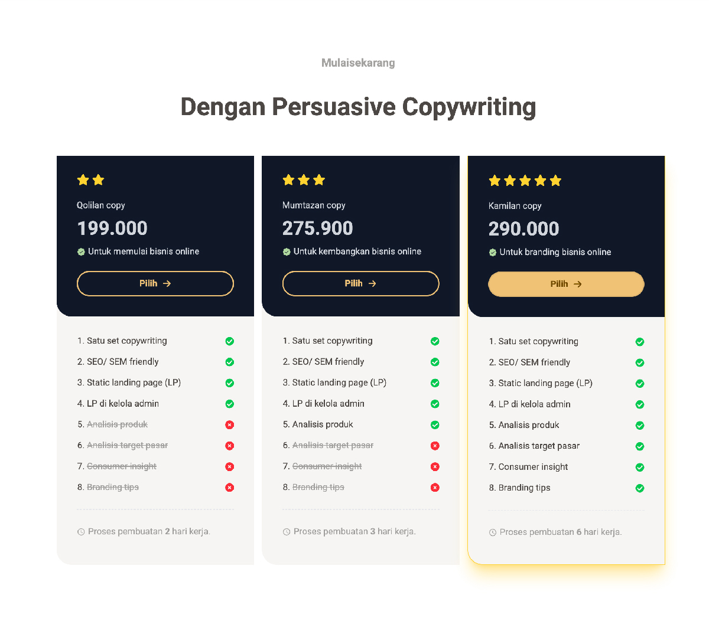

# 💎 Spesifikasi: ExalviaService

Section paket layanan (Pricing) yang dirancang untuk mempermudah klien memilih skema jasa copywriting yang paling sesuai dengan kebutuhan bisnis mereka.

**Implementasi:** [ExalviaService.js](../../sections/ExalviaService.js)

---

## 🏗️ Tata Letak & Perilaku (Layout & Behavior)

- **Header Section:** Centered Header menggunakan `ExalviaSectionHeader`.
- **Pricing Grid:**
  - **Desktop:** Grid 3-kolom (`grid-cols-3`).
  - **Mobile:** Tumpukan vertikal (`flex-col`).
- **Container Size:** `lg:w-10/12 sm:w-11/12 w-full mx-auto`.
- **Architectural Style:**
  - Padding luas: `py-20 md:py-32`.
  - Kartu Highlight: Salah satu kartu (biasanya paket paling populer) memiliki aksen border emas dan bayangan halus untuk menarik perhatian.

---

## 🍱 Struktur Konten (Service Section Structure)

Data diambil dari objek `service` di `ExalviaDatabase.js`:

### 1. Pricing Card (ExalviaCard based)

Kartu dibagi menjadi dua area utama:

#### A. Top Area (Identitas & Harga)

- **Rating:** Menampilkan ikon bintang (`ExalviaRating`) sesuai level paket.
- **Plan Name:** Nama paket (misal: "Qolilan Copy").
- **Pricing:** Harga prominent dengan format ribuan yang jelas.
- **Short Info:** Teks penjelas target penggunaan (misal: "Untuk branding bisnis online").
- **CTA Button:** Tombol "Pilih" menggunakan `ExalviaLinkButton`. Gunakan `variant="outline"` untuk paket biasa dan `variant="primary"` (solid warning) untuk paket highlight.

#### B. Bottom Area (Fitur Detail)

- **Feature List:** Loop data fitur paket.
  - Poin yang **termasuk**: Ikon centang hijau (`FaCheckCircle`).
  - Poin yang **tidak termasuk**: Ikon silang merah (`FaTimesCircle`).
- **Workflow Info:** Keterangan waktu pengerjaan di bagian paling bawah (misal: "Proses pembuatan 6 hari kerja").

---

## 🛠️ Instruksi Teknis untuk AI

1.  **Visual Hierarchy:** Gunakan latar belakang gelap (`bg-neutral`) pada area Top kartu dan latar belakang terang (`bg-base-200`) pada area Bottom untuk menciptakan pemisahan visual yang kuat.
2.  **Atomic Consistency:** Wajib menggunakan `ExalviaRating`, `ExalviaLinkButton`, dan `ExalviaCard`.
3.  **No Blur Policy:** Gunakan solid contrast dan clean lines. Dilarang menggunakan backdrop filter.
4.  **Database Binding:** Seluruh detail harga, list fitur, dan status centang wajib diambil dari database.

---

## 📸 Referensi Visual

