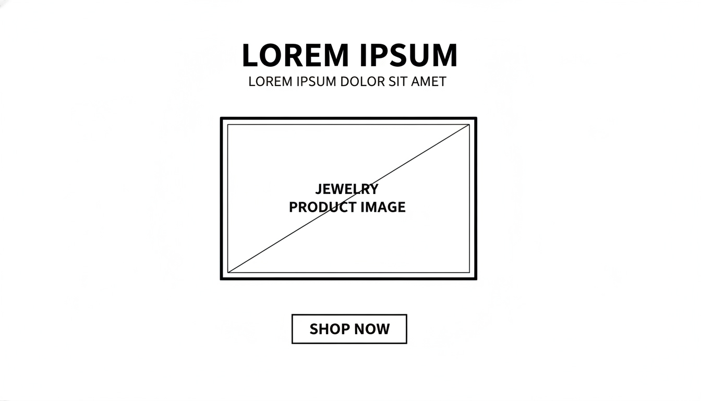

## HeroSection

**Target file implementasi (akan dibuat):**

- `src/app/bonus/landingpageTemplate/savheera/sections/SavheeraHeroSection.js`

**Database Update (WAJIB):**
Setiap kali section JavaScript dibuat, WAJIB update `src/app/bonus/landingpageTemplate/savheera/database/SavheeraDatabase.js` dengan data structure yang sesuai konsep ini.

**Referensi wireframe layout:**



Ringkasan layout dari wireframe:

- **Alignment utama:** center (teks dan CTA rata tengah)
- **Urutan elemen:**
  - Headline (besar)
  - Subtitle (di bawah headline)
  - Hero image (center, dominan)
  - CTA button (di bawah image)
- **Grid/kolom:** single column (stack vertikal) untuk semua breakpoint (hero versi ini tidak menggunakan 2 kolom)
- **Catatan implementasi responsif:** pastikan hero image `w-full` dengan max-width yang nyaman di desktop (mis. `max-w-3xl`) agar tetap terasa elegan dan tidak memenuhi seluruh layar

Hero Section adalah bagian pertama yang membangun kesan **elegan, lembut, dan aspiratif**. Fokusnya bukan hard selling, tetapi membuat pengunjung langsung merasakan:

- **Momen spesial**
- **Keanggunan yang tenang**
- **Inspirasi memilih perhiasan yang tepat**

---

## 1. Tujuan

- Menjelaskan positioning Savheera: perhiasan untuk momen spesial (wedding, gala, anniversary, acara formal).
- Menghadirkan “editorial mood” melalui imagery yang high-end.
- Mengarahkan user ke CTA yang **soft** (jelajah koleksi / konsultasi / lihat inspirasi).

---

## 2. Struktur Konten (Wajib)

Susunan ideal (urut, tidak harus semua panjang):

- **Badge / Eyebrow** (opsional)
  - Contoh: `Koleksi untuk Momen Spesial`
- **Headline utama (Serif)**
  - 1 kalimat kuat, aspiratif
- **Subtitle / Lead (Sans-serif)**
  - 1–2 kalimat lembut, menguatkan konteks “pilihan tepat” dan “momen tak terlupakan”
- **Primary CTA (Gold / `primary`)**
  - Soft CTA: jelajahi / temukan / lihat inspirasi
- **Secondary CTA (opsional)**
  - Misal: `Lihat Koleksi` / `Konsultasi` / `Lihat Lookbook`
- **Hero Image / Hero Media**
  - Foto editorial, menonjolkan kilau & detail
- **Trust Snippet (opsional)**
  - Misal: “Dipilih untuk wedding, gala, dan momen tak terlupakan.”

---

## 3. Copywriting (Tone & Voice)

### Prinsip

- Lembut, elegan, inspiratif, aspiratif.
- Hindari hard selling, hindari kata “diskon”, “termurah”, “promo agresif”.
- Gunakan kata/frasa yang disarankan: **memukau, istimewa, momen tak terlupakan, berkesan, pilihan sempurna**.

### Opsi Headline

- `Perhiasan yang Membuat Momen Anda Bersinar`
- `Keanggunan Tenang untuk Momen Tak Terlupakan`
- `Pilihan Sempurna untuk Hari yang Istimewa`

### Opsi Subtitle

- `Temukan kilau yang melengkapi setiap langkah Anda—dari wedding hingga gala malam.`
- `Savheera menghadirkan detail yang berkelas, untuk Anda yang ingin tampil memukau tanpa berlebihan.`
- `Koleksi yang dirancang untuk menghidupkan suasana, menegaskan karakter, dan meninggalkan kesan.`

### Opsi CTA (Soft)

- Primary:
  - `Jelajahi Koleksi`
  - `Temukan Pilihan Anda`
  - `Lihat Inspirasi`
- Secondary:
  - `Konsultasi Pemilihan`
  - `Lihat Lookbook`

---

## 4. Visual & Imagery (Wajib)

- Hero image harus terasa **high-end/editorial**.
- Tema: perhiasan di konteks acara nyata (wedding, gala, anniversary).
- Fokus: kilau, detail material, finishing.
- Warna/tone harus selaras dengan palet Savheera (Ivory/Champagne sebagai dominan, Gold hanya aksen).

---

## 5. Styling & Layout (Guideline)

- Gunakan Tailwind CSS + DaisyUI theme `savheera`.
- Ikuti aturan warna **60–30–10**:
  - Dominan: `base-100` / `base-200`
  - Sekunder: `secondary` / `accent` secukupnya
  - Aksen Gold (`primary`) hanya untuk CTA/highlight.
- White space wajib cukup: section spacing minimal `py-20`.
- Border radius hanya di button, card, image container.

### Layout responsif (rekomendasi)

- Mobile-first.
- Mobile: stack atas-bawah (teks lalu gambar).
- Tablet/Desktop: 2 kolom (teks kiri, image kanan) dengan keseimbangan whitespace.

---

## 6. Animasi & Interaksi (Lembut)

- Gunakan animasi ringan:
  - CTA: `hover:scale-105 transition-transform duration-300 ease-in-out`
  - Link: `hover:text-primary transition-colors duration-300`
- Hero image: `data-aos="fade-up"` atau `data-aos="fade-in"`.
- Hindari animasi agresif/flashy.

---

## 7. Accessibility & Performance

- Semua gambar wajib `alt`.
- Pastikan kontras teks (Deep Navy vs Ivory/Champagne) jelas.
- Touch target CTA jelas di mobile.
- Optimasi gambar: webp/avif, ukuran responsif.
- Hindari banyak elemen berat di above-the-fold.

---

## 8. Data-driven (Wajib: ambil dari Database)

- Semua teks, URL gambar, dan ikon React harus berasal dari `SavheeraDatabase.js`.
- Hero section tidak boleh hardcode copy.

Contoh struktur data yang disarankan:

```js
export const SavheeraDatabase = {
  hero: {
    label: "Koleksi untuk Momen Spesial",
    title: "Perhiasan yang Membuat Momen Anda Bersinar",
    subtitle: "Savheera menghadirkan detail berkelas untuk wedding, gala, dan hari istimewa Anda.",
    ctaPrimary: { label: "Jelajahi Koleksi", href: "#collection" },
    ctaSecondary: { label: "Lihat Inspirasi", href: "#lookbook" },
    image: { src: "/images/savheera/hero.webp", alt: "Model memakai perhiasan Savheera di acara formal" },
    trustNote: "Dipilih untuk momen tak terlupakan.",
  },
};
```

---

## 9. Catatan Implementasi Section

- Gunakan template section dari `07-implementation.md`.
- Pastikan `secId` dipasang pada wrapper utama untuk navigasi anchor.
