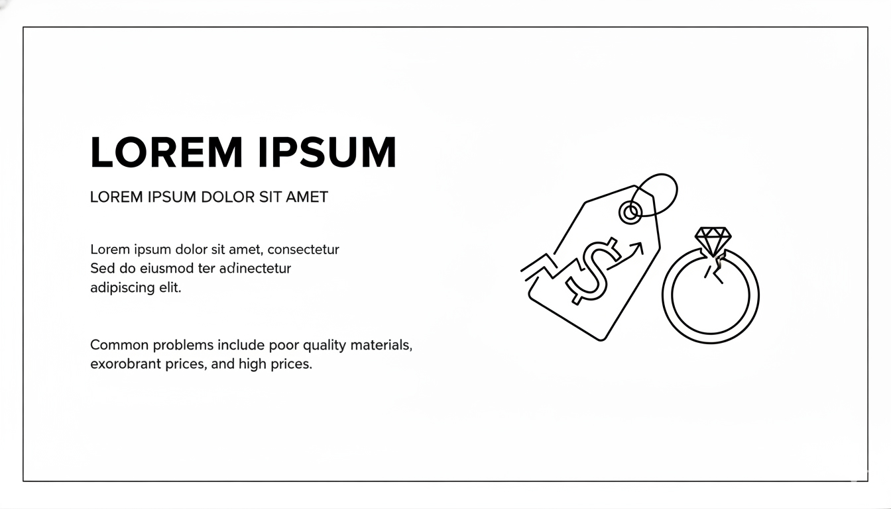

## ProblemSection

**Target file implementasi (akan dibuat):**

- `src/app/bonus/landingpageTemplate/savheera/sections/SavheeraProblemSection.js`

**Database Update (WAJIB):**
Setiap kali section JavaScript dibuat, WAJIB update `src/app/bonus/landingpageTemplate/savheera/database/SavheeraDatabase.js` dengan data structure yang sesuai konsep ini.

Problem Section berfungsi membangun empati: pengunjung merasa “ini saya” sebelum diarahkan ke Solution. Tone tetap **lembut, elegan, aspiratif** (bukan menekan atau dramatis berlebihan).

**Referensi wireframe layout:**



## Ringkasan

## 1. Tujuan

- Mengangkat pain point utama saat memilih perhiasan untuk momen spesial.
- Membuat pengunjung merasa dipahami, tanpa hard selling.
- Menyiapkan transisi natural menuju Solution: Savheera sebagai jawaban elegan.

---

## 2. Problem Utama (berdasarkan Project Goal)

Gunakan 2–4 poin utama berikut (hindari terlalu banyak):

1. **Sulit menentukan pilihan yang “tepat” untuk tema acara**
   - Takut terlihat terlalu ramai atau justru kurang berkesan.
2. **Kurangnya referensi inspiratif**
   - Bingung mencocokkan perhiasan dengan outfit, warna kulit, dan mood acara.
3. **Ingin tampil elegan tanpa terlihat berlebihan**
   - Butuh detail yang halus, tetapi tetap memukau.
4. **Khawatir kualitas dan finishing tidak sesuai ekspektasi momen penting**
   - Momen spesial tidak memberi ruang untuk “salah pilih”.

---

## 3. Struktur Konten (Wajib)

Susunan yang direkomendasikan:

- **Eyebrow/Badge** (opsional)
  - Contoh: `Sering Terjadi Sebelum Hari Istimewa`
- **Heading (Serif)**
  - 1 kalimat pendek, elegan, memvalidasi masalah
- **Lead/Subtitle (Sans-serif)**
  - 1–2 kalimat untuk menjelaskan konteks
- **Problem List / Cards (2–4 item)**
  - Format: judul singkat + 1 kalimat penjelas
- **Visual pendukung (opsional namun disarankan)**
  - Ilustrasi/foto editorial yang menggambarkan kebingungan memilih (tetap premium)

---

## 4. Copywriting (Tone & Voice)

### Prinsip

- Validasi perasaan (empati), bukan menakut-nakuti.
- Pilih kata yang lembut: “sering terasa”, “wajar”, “kadang”, “mencari yang pas”.
- Hindari kata yang agresif: “Anda pasti salah”, “fatal”, “buruk”, “murahan”.

### Opsi Heading

- `Memilih yang Tepat Kadang Lebih Sulit dari yang Terlihat`
- `Momen Spesial Butuh Detail yang Tepat`
- `Ingin Memukau, Tapi Tetap Terasa Natural`

### Opsi Subtitle

- `Wajar jika Anda ingin perhiasan yang menyatu dengan tema acara—tanpa terasa berlebihan.`
- `Saat hari istimewa semakin dekat, yang Anda butuhkan bukan sekadar perhiasan, tetapi pilihan yang pas.`

### Contoh Problem Items (judul + deskripsi)

- **Takut tidak cocok dengan tema acara**
  - `Antara terlalu ramai atau terlalu sederhana—sulit menemukan titik elegannya.`
- **Kurang inspirasi untuk memadukan look**
  - `Memilih perhiasan yang menyatu dengan outfit sering memakan waktu dan energi.`
- **Ingin tampil berkesan tanpa terlihat berlebihan**
  - `Detail yang halus dan finishing yang tepat membuat perbedaan besar.`
- **Khawatir kualitas di momen penting**
  - `Momen tak terlupakan butuh rasa percaya diri dari kualitas yang terjamin.`

---

## 5. Visual & Imagery (Wajib)

Mengacu `03-design/imagery.md`:

- Visual tetap **high-quality** dan “editorial”.
- Jika memakai foto, pilih tone warna konsisten dengan palet Savheera (Ivory/Champagne dominan).
- Hindari visual yang terlalu ramai.

Rekomendasi layout visual:

- Desktop: 2 kolom (teks + cards di satu sisi, visual di sisi lain).
- Mobile: stack (teks → cards → visual).

---

## 6. Styling & Layout (Guideline)

Mengacu brand guidelines + `07-implementation.md`:

- Gunakan Tailwind + DaisyUI theme `savheera`.
- Warna dominan netral (`base-100` / `base-200`), aksen `primary` (Gold) hanya untuk highlight kecil.
- White space lega: section `py-20`.
- Border radius hanya pada card/image container.

Komponen UI yang cocok:

- `card` atau container dengan border halus (`border-base-300`) dan background netral.
- Icon (opsional) harus satu gaya, ukuran konsisten, dan tidak dominan.

---

## 7. Animasi & Interaksi

Mengacu `03-design/animation.md`:

- Card problem bisa pakai `transition-shadow duration-300` dan `hover:shadow-lg` secara halus.
- Masuk viewport pakai AOS: `data-aos="fade-up"` pada tiap card atau pada container.

---

## 8. Accessibility & Performance

- Pastikan struktur heading rapi (H2/H3) untuk SEO.
- Jika ada gambar: wajib `alt`.
- Hindari animasi berat dan elemen yang memperlambat LCP.

---

## 9. Data-driven (Wajib dari SavheeraDatabase)

Semua teks dan visual harus diambil dari `SavheeraDatabase.js`.

Contoh struktur data yang disarankan:

```js
export const SavheeraDatabase = {
  problem: {
    label: "Sering Terjadi Sebelum Hari Istimewa",
    title: "Memilih yang Tepat Kadang Lebih Sulit dari yang Terlihat",
    subtitle: "Wajar jika Anda ingin perhiasan yang menyatu dengan tema acara—tanpa terasa berlebihan.",
    items: [
      { title: "Takut tidak cocok dengan tema acara", desc: "Antara terlalu ramai atau terlalu sederhana—sulit menemukan titik elegannya." },
      { title: "Kurang inspirasi untuk memadukan look", desc: "Memilih perhiasan yang menyatu dengan outfit sering memakan waktu dan energi." },
      { title: "Ingin tampil berkesan tanpa terlihat berlebihan", desc: "Detail yang halus dan finishing yang tepat membuat perbedaan besar." },
    ],
    image: { src: "/images/savheera/problem.webp", alt: "Momen memilih perhiasan untuk acara formal" },
  },
};
```

---

## 10. Catatan Implementasi

- Ikuti template section di `07-implementation.md`.
- Gunakan `secId` untuk anchor navigasi.
- Pastikan section ini mengalir halus ke `Solution Section` (jangan ada CTA agresif di Problem).
