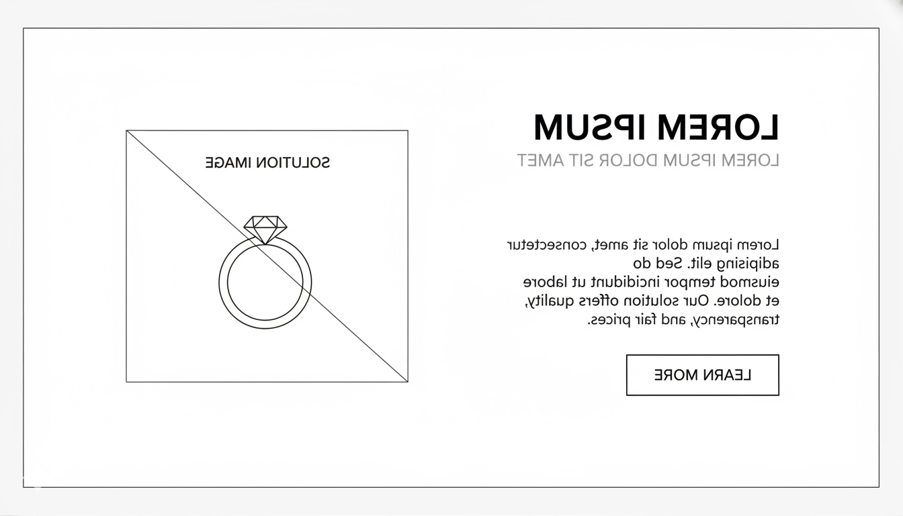

## SolutionSection

**Target file implementasi (akan dibuat):**

- `src/app/bonus/landingpageTemplate/savheera/sections/SavheeraSolutionSection.js`

**Referensi wireframe layout:**



Ringkasan layout dari wireframe:

- **Grid/kolom:** 2 kolom (desktop)
  - Kiri: hero/solution image
  - Kanan: heading + subtitle + deskripsi + CTA
- **Mobile:** stack (image di atas, konten di bawah)
- **CTA:** satu tombol utama di area konten

---

Solution Section adalah jawaban elegan dari Problem Section. Tujuannya membuat pengunjung merasa: “akhirnya ada pilihan yang pas”, tanpa hard selling.

---

## 1. Tujuan

- Menegaskan Savheera sebagai solusi: **perhiasan yang membantu tampil memukau dan tepat untuk tema acara**.
- Menggeser emosi dari “ragu memilih” menjadi “lebih yakin & terarah”.
- Mengarahkan ke langkah berikutnya (Features / Proof / Collection) dengan CTA yang lembut.

---

## 2. Konsep Pesan Utama

Gunakan 1 pesan utama yang konsisten:

- Savheera membantu Anda menemukan perhiasan yang **selaras dengan momen** (tema, outfit, dan kesan), dengan detail yang berkelas.

Contoh angle yang cocok:

- “Koleksi yang dirancang untuk momen penting”
- “Detail halus, tampilan berkesan”
- “Pilihan elegan, tanpa terasa berlebihan”

---

## 3. Struktur Konten (Wajib)

- **Badge / Eyebrow** (opsional)
  - Contoh: `Solusi untuk Hari Istimewa`
- **Heading (Serif)**
  - 1 kalimat aspiratif
- **Subtitle / Lead (Sans-serif)**
  - 1–2 kalimat yang menjelaskan solusi secara lembut
- **Supporting Points (2–3 poin)**
  - Bisa berupa list pendek atau mini-cards
- **CTA utama**
  - Soft CTA: jelajahi koleksi / lihat inspirasi / konsultasi
- **Visual utama (Solution Image)**
  - Foto editorial perhiasan (high-end)

---

## 4. Copywriting (Tone & Voice)

### Prinsip

- Lembut, elegan, inspiratif.
- Hindari klaim berlebihan.
- Fokus pada “makna momen + rasa percaya diri”.

### Opsi Heading

- `Saat Momen Penting, Pilih yang Terasa Tepat`
- `Keanggunan yang Menyatu dengan Cerita Anda`
- `Detail Berkelas untuk Hari yang Istimewa`

### Opsi Subtitle

- `Savheera menghadirkan koleksi yang dirancang untuk melengkapi momen spesial—dengan kilau yang halus, namun berkesan.`
- `Temukan perhiasan yang menyatu dengan tema acara dan membuat Anda tampil memukau tanpa berlebihan.`

### Supporting Points (contoh)

- **Selaras dengan tema acara**
  - `Mudah dipadukan untuk wedding, gala, hingga perayaan elegan.`
- **Detail halus, finishing berkelas**
  - `Kilau dan detail yang terasa premium di setiap sudut.`
- **Membantu tampil percaya diri**
  - `Pilihan yang tepat membuat Anda fokus pada momen, bukan keraguan.`

### Opsi CTA (Soft)

- `Jelajahi Koleksi`
- `Lihat Inspirasi`
- `Konsultasi Pemilihan`

---

## 5. Visual & Imagery

Mengacu `03-design/imagery.md`:

- Gunakan foto editorial, high-quality.
- Fokus pada kilau, detail material, dan finishing.
- Tone warna selaras dengan palet Savheera (Ivory/Champagne dominan, Gold sebagai aksen).
- Hindari background terlalu ramai.

Rekomendasi bentuk gambar:

- Container dengan radius sesuai theme (image container boleh rounded).
- Pastikan gambar responsif dan tidak menyebabkan CLS.

---

## 6. Styling & Layout (Guideline)

- Gunakan Tailwind + DaisyUI theme `savheera`.
- Terapkan aturan warna 60–30–10:
  - Background: `base-100`/`base-200`
  - CTA utama: `primary` (Gold)
- Spacing section: `py-20`.
- Jaga white space agar terasa “bernapas”.

Layout mengikuti wireframe:

- Desktop: 2 kolom (image kiri, konten kanan) dengan jarak yang cukup.
- Mobile: stack vertikal.

---

## 7. Animasi & Interaksi

Mengacu `03-design/animation.md`:

- Gunakan AOS halus:
  - Image: `data-aos="fade-up"`
  - Konten: `data-aos="fade-up"` dengan delay kecil
- CTA: hover lembut (`transition-transform duration-300 ease-in-out`)

---

## 8. Accessibility & Performance

- Struktur heading jelas (jangan lompat level).
- Alt text wajib pada image.
- Optimasi gambar (webp/avif, ukuran responsif).
- Hindari elemen berat di atas fold.

---

## 9. Data-driven (Wajib dari SavheeraDatabase)

Semua teks dan visual harus diambil dari `SavheeraDatabase.js`.

Contoh struktur data yang disarankan:

```js
export const SavheeraDatabase = {
  solution: {
    label: "Solusi untuk Hari Istimewa",
    title: "Saat Momen Penting, Pilih yang Terasa Tepat",
    subtitle: "Savheera menghadirkan koleksi yang dirancang untuk melengkapi momen spesial—dengan kilau yang halus, namun berkesan.",
    points: [
      { title: "Selaras dengan tema acara", desc: "Mudah dipadukan untuk wedding, gala, hingga perayaan elegan." },
      { title: "Detail halus, finishing berkelas", desc: "Kilau dan detail yang terasa premium di setiap sudut." },
      { title: "Membantu tampil percaya diri", desc: "Pilihan yang tepat membuat Anda fokus pada momen, bukan keraguan." },
    ],
    cta: { label: "Jelajahi Koleksi", href: "#collection" },
    image: { src: "/images/savheera/solution.webp", alt: "Perhiasan Savheera dengan detail berkelas" },
  },
};
```

---

## 10. Catatan Implementasi

- Ikuti template section di `07-implementation.md`.
- Gunakan `secId` untuk anchor.
- CTA tetap soft (tidak agresif), dan mengarah ke section berikutnya (Features/Proof/Collection).
