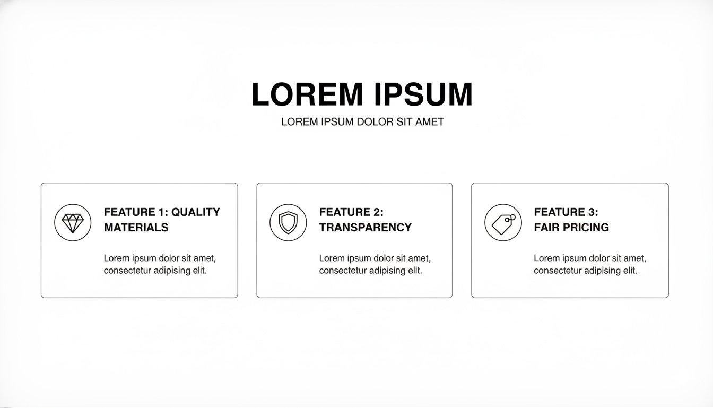

# Feature Section - Savheera Jewelry Landing Page

## Target file implementasi (akan dibuat)

`src/app/bonus/landingpageTemplate/savheera/sections/SavheeraFeature.js`

**Database Update (WAJIB):**
Setiap kali section JavaScript dibuat, WAJIB update `src/app/bonus/landingpageTemplate/savheera/database/SavheeraDatabase.js` dengan data structure yang sesuai konsep ini.

## Wireframe Layout Reference



**Key Layout Notes:**

- Grid layout dengan 3-4 feature cards dalam baris (desktop)
- Setiap card: icon + judul + deskripsi singkat
- Mobile: single column dengan card bertumpuk
- Konsisten spacing dan alignment

---

## Purpose & Goals

Menampilkan keunggulan utama Savheera yang membedakan dari kompetitor. Section ini membangun kepercayaan dengan menyoroti nilai-nilai inti: craftsmanship, kualitas material, desain elegan, dan layanan personal. Tujuannya adalah meyakinkan pengunjung bahwa Savheera adalah pilihan terbaik untuk perhiasan momen spesial.

---

## Content Structure

### Mandatory Elements:

- **Section Badge**: Label kecil untuk identifikasi section
- **Headline**: Judul utama yang menarik perhatian
- **Subtitle**: Penjelasan singkat tentang nilai Savheera
- **Feature Cards Grid** (3-4 items):
  - Icon/Gambar representatif
  - Feature title
  - Deskripsi singkat (2-3 baris)
- **Optional CTA**: Tombol secondary untuk 了解更多

### Optional Elements:

- Background pattern atau texture halus
- Hover effects pada cards
- Micro-animations untuk icons

---

## Copywriting Guidelines

### Tone & Voice:

- **Elegant & Confident**: Menampilkan keunggulan dengan percaya diri
- **Benefit-focused**: Fokus pada apa yang didapat customer
- **Soft-sell**: Tidak berlebihan, tetap sophisticated

### Example Headlines:

- "Keunggulan yang Membedakan Savheera"
- "Mengapa Perhiasan Kami Spesial"
- "Craftsmanship Meets Elegance"

### Example Feature Titles:

- "Material Premium Berkualitas Tinggi"
- "Desain Eksklusif oleh Artisan Berpengalaman"
- "Garansi Kepuasan 100%"
- "Layanan Konsultasi Personal"

### CTA Examples:

- "Pelajari Lebih Lanjut"
- "Jelajahi Koleksi Kami"
- "Temukan Keunggulan Kami"

---

## Visual & Imagery Guidelines

### Icons:

- Style: Line art atau subtle filled icons
- Color: Gold atau Deep Navy (sesuai 60-30-10 rule)
- Size: Konsisten, tidak terlalu besar
- Theme: Elegant, minimalis, meaningful

### Background:

- Warna: Ivory atau Champagne yang sangat ringan
- Pattern: Opsional, subtle texture
- Gradient: Hindari, tetap flat

### Photography:

- Jika menggunakan gambar: high-end product shots
- Lighting: Soft, elegant
- Focus: Pada detail dan kualitas

---

## Styling & Layout

### Container:

- Max-width: 1200px (centered)
- Padding: 80px 20px (desktop), 60px 16px (mobile)
- Background: Ivory atau white

### Grid Layout:

```jsx
// Desktop (3-4 columns)
<div className="grid grid-cols-1 md:grid-cols-2 lg:grid-cols-3 xl:grid-cols-4 gap-8">

// Mobile (1 column)
<div className="space-y-6">
```

### Card Design:

- Background: White dengan soft shadow
- Border: Subtle, radius 8-12px
- Padding: 24px
- Hover: Lift effect dengan transform
- Border: 1px solid rgba(212, 175, 55, 0.1)

### Typography:

- Headline: `text-3xl md:text-4xl font-serif`
- Feature Title: `text-xl font-semibold`
- Description: `text-base opacity-80`
- Color: `text-base-content`

---

## Animation & Interactions

### On Scroll:

- AOS fade-up untuk cards
- Stagger animation (delay bertahap)
- Duration: 600ms, easing: ease-out

### Hover Effects:

```jsx
className = "transform transition-all duration-300 hover:scale-105 hover:shadow-lg";
```

### Icon Animations:

- Subtle pulse atau rotate on hover
- Tidak berlebihan, tetap elegant

---

## Accessibility

### Alt Text:

- Icons: Deskripsi fungsional (contoh: "Icon material premium")
- Images: Deskripsi kontekstual

### Keyboard Navigation:

- Cards dapat di-focus
- Tab order yang logical

### Screen Readers:

- Proper heading hierarchy
- ARIA labels jika needed

---

## Performance Optimization

### Images:

- WebP/AVIF format
- Lazy loading untuk images below fold
- Proper sizing (tidak lebih besar dari needed)

### Animation:

- CSS transforms untuk smooth performance
- Hindari JavaScript-heavy animations
- GPU-accelerated properties

---

## Data-Driven Implementation

### Data Structure (dari SavheeraDatabase.js):

```javascript
features: {
  badge: "Keunggulan Kami",
  headline: "Mengapa Perhiasan Savheera Spesial",
  subtitle: "Setiap piece diciptakan dengan passion dan dedikasi untuk keindahan abadi",
  items: [
    {
      id: 1,
      icon: "gem", // atau path ke icon
      title: "Material Premium",
      description: "Hanya menggunakan material berkualitas tinggi dengan sertifikat keaslian"
    },
    // ... more items
  ],
  cta: {
    text: "Pelajari Lebih Lanjut",
    href: "/about"
  }
}
```

### Component Usage:

```jsx
import { savheeraData } from "../database/SavheeraDatabase.js";

// Di dalam component
const { features } = savheeraData;
```

---

## Implementation Notes

### Responsive Considerations:

- Mobile: Single column dengan card spacing yang cukup
- Tablet: 2 columns
- Desktop: 3-4 columns tergantung content

### DaisyUI Classes:

- Card components: `card card-compact`
- Shadow: `shadow-lg hover:shadow-xl`
- Colors: Gunakan theme colors

### CSS Custom Properties:

```css
:root {
  --feature-card-padding: 24px;
  --feature-card-radius: 12px;
  --feature-icon-size: 48px;
}
```

---

## Testing Requirements

### Visual Testing:

- Layout consistency di semua breakpoints
- Hover effects smooth
- Icon alignment perfect

### Content Testing:

- Text tidak overflow
- Spacing konsisten
- Hierarchy jelas

### Performance:

- Lighthouse score >90
- Smooth 60fps animations
- Fast load time

---

## Related Files

- Database: `src/app/bonus/landingpageTemplate/savheera/database/SavheeraDatabase.js`
- Implementation Guide: `concept/07-implementation.md`
- Brand Guidelines: `concept/00-overview/brand-guidelines.md`
- Color Palette: `concept/03-design/color-palette.md`
