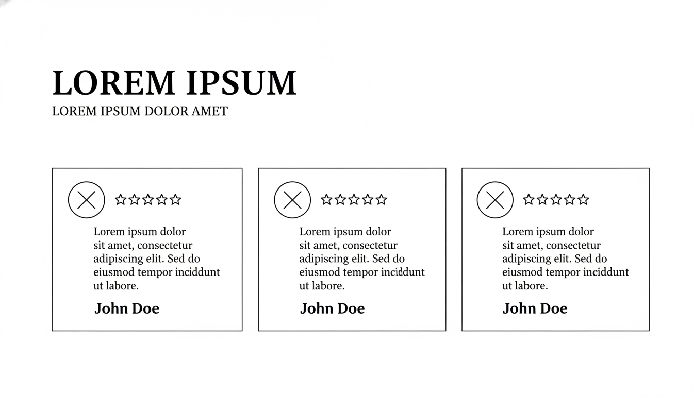

# Proof Section - Savheera Jewelry Landing Page

## Target file implementasi (akan dibuat)

`src/app/bonus/landingpageTemplate/savheera/sections/SavheeraProof.js`

**Database Update (WAJIB):**
Setiap kali section JavaScript dibuat, WAJIB update `src/app/bonus/landingpageTemplate/savheera/database/SavheeraDatabase.js` dengan data structure yang sesuai konsep ini.

## Wireframe Layout Reference



**Key Layout Notes:**

- Testimonial cards dengan foto customer + quote + nama
- Grid layout 2-3 kolom (desktop)
- Mobile: single column dengan card bertumpuk
- Rating stars atau indikator kepuasan

---

## Purpose & Goals

Membuktikan kredibilitas dan kepuasan pelanggan Savheera melalui testimonial dan social proof. Section ini membangun trust dengan menampilkan pengalaman nyata pelanggan yang telah merasakan keindahan dan kualitas perhiasan Savheera. Tujuannya adalah menghilangkan keraguan dan memperkuat keputusan pembelian.

---

## Content Structure

### Mandatory Elements:

- **Section Badge**: Label untuk identifikasi section
- **Headline**: Judul utama tentang kepuasan pelanggan
- **Subtitle**: Penjelasan singkat tentang komitmen Savheera
- **Testimonial Cards Grid** (3-6 items):
  - Customer photo (profil picture)
  - Customer name dan lokasi
  - Rating (5 stars atau similar)
  - Testimonial quote (2-3 baris)
  - Optional: Product yang dibeli
- **Optional CTA**: Tombol untuk lihat lebih banyak testimonial

### Optional Elements:

- Overall statistics (jumlah pelanggan puas)
- Social media mentions
- Press mentions atau awards
- Video testimonials

---

## Copywriting Guidelines

### Tone & Voice:

- **Authentic & Genuine**: Testimonial yang terasa nyata
- **Heartfelt**: Emosi dan kebahagiaan pelanggan
- **Trustworthy**: Membangun confidence tanpa over-promising

### Example Headlines:

- "Kata Mereka Tentang Savheera"
- "Kepercayaan yang Membangun Keindahan"
- "Pengalaman Berharga Pelanggan Kami"

### Example Testimonial Quotes:

- "Perhiasan Savheera melengkapi momen spesial saya dengan sempurna. Kualitasnya luar biasa!"
- "Saya sangat terkesan dengan craftsmanship dan pelayanannya. Highly recommended!"
- "Desainnya elegan dan sesuai ekspektasi. Uang yang sangat worth it."

### Customer Info Format:

- Nama Lengkap
- Kota/Negara
- Product yang dibeli (opsional)
- Tanggal pembelian (opsional)

---

## Visual & Imagery Guidelines

### Customer Photos:

- Style: Professional tapi natural
- Size: Konsisten, circular crop
- Quality: High resolution
- Background: Clean, tidak mengganggu

### Rating Display:

- Icon: Gold stars atau elegant indicators
- Size: Konsisten dengan layout
- Color: Gold untuk highlight

### Card Design:

- Background: White dengan soft shadow
- Border: Subtle, radius 12-16px
- Layout: Clean, organized
- Spacing: Cukup untuk readability

---

## Styling & Layout

### Container:

- Max-width: 1200px (centered)
- Padding: 80px 20px (desktop), 60px 16px (mobile)
- Background: Ivory atau very light Champagne

### Grid Layout:

```jsx
// Desktop (2-3 columns)
<div className="grid grid-cols-1 md:grid-cols-2 lg:grid-cols-3 gap-8">

// Mobile (1 column)
<div className="space-y-6">
```

### Card Design:

```jsx
<div className="bg-white rounded-xl shadow-lg p-6 hover:shadow-xl transition-shadow">
  {/* Customer photo */}
  <div className="w-16 h-16 rounded-full overflow-hidden mb-4">
    
  </div>

  {/* Content */}
  <div className="space-y-3">
    {/* Rating */}
    {/* Quote */}
    {/* Customer info */}
  </div>
</div>
```

### Typography:

- Headline: `text-3xl md:text-4xl font-serif`
- Quote: `text-base italic opacity-90`
- Customer Name: `text-lg font-semibold`
- Customer Location: `text-sm opacity-70`
- Color: `text-base-content`

---

## Animation & Interactions

### On Scroll:

- AOS fade-up untuk cards
- Stagger animation (delay bertahap)
- Duration: 600ms, easing: ease-out

### Hover Effects:

- Subtle shadow enhancement
- Tidak ada scale untuk menjaga readability
- Smooth transition (300ms)

### Quote Animation:

- Fade in untuk quote text
- Delayed untuk customer info

---

## Accessibility

### Alt Text:

- Customer photos: "Photo of [Name] from [Location]"
- Rating icons: "5 star rating" atau similar

### Keyboard Navigation:

- Cards dapat di-focus
- Tab order yang logical

### Screen Readers:

- Proper heading hierarchy
- ARIA labels untuk interactive elements
- Semantic HTML5 structure

---

## Performance Optimization

### Images:

- WebP/AVIF format untuk customer photos
- Lazy loading untuk below fold
- Proper sizing (tidak lebih besar dari needed)
- Compression untuk fast loading

### Animation:

- CSS transforms untuk smooth performance
- GPU-accelerated properties
- Minimal JavaScript

---

## Data-Driven Implementation

### Data Structure (dari SavheeraDatabase.js):

```javascript
proof: {
  badge: "Testimonial Pelanggan",
  headline: "Kata Mereka Tentang Savheera",
  subtitle: "Kebahagiaan pelanggan adalah kebanggaan kami",
  stats: {
    customersCount: "2,500+",
    satisfactionRate: "98%",
    countriesServed: "15"
  },
  items: [
    {
      id: 1,
      customer: {
        name: "Sarah Wijaya",
        location: "Jakarta, Indonesia",
        photo: "/images/customers/sarah.jpg",
        product: "Diamond Necklace"
      },
      rating: 5,
      quote: "Perhiasan Savheera melengkapi momen spesial saya dengan sempurna. Kualitasnya luar biasa!",
      date: "2024-01-15"
    },
    // ... more testimonials
  ],
  cta: {
    text: "Lihat Semua Testimonial",
    href: "/testimonials"
  }
}
```

### Component Usage:

```jsx
import { savheeraData } from "../database/SavheeraDatabase.js";

// Di dalam component
const { proof } = savheeraData;

// Render testimonials
{
  proof.items.map((testimonial) => <TestimonialCard key={testimonial.id} data={testimonial} />);
}
```

---

## Implementation Notes

### Responsive Considerations:

- Mobile: Single column dengan card spacing yang cukup
- Tablet: 2 columns
- Desktop: 3 columns optimal

### DaisyUI Classes:

- Card components: `card card-compact`
- Avatar: `avatar`
- Rating: `rating rating-lg`
- Shadow: `shadow-lg hover:shadow-xl`

### CSS Custom Properties:

```css
:root {
  --testimonial-card-padding: 24px;
  --testimonial-card-radius: 16px;
  --customer-avatar-size: 64px;
  --rating-star-size: 20px;
}
```

---

## Testing Requirements

### Visual Testing:

- Layout consistency di semua breakpoints
- Photo quality dan alignment
- Text readability

### Content Testing:

- Quote tidak overflow
- Customer info formatting consistent
- Rating display correct

### Performance:

- Lighthouse score >90
- Fast image loading
- Smooth animations

---

## Related Files

- Database: `src/app/bonus/landingpageTemplate/savheera/database/SavheeraDatabase.js`
- Implementation Guide: `concept/07-implementation.md`
- Brand Guidelines: `concept/00-overview/brand-guidelines.md`
- Color Palette: `concept/03-design/color-palette.md`
- Typography: `concept/03-design/typography.md`
