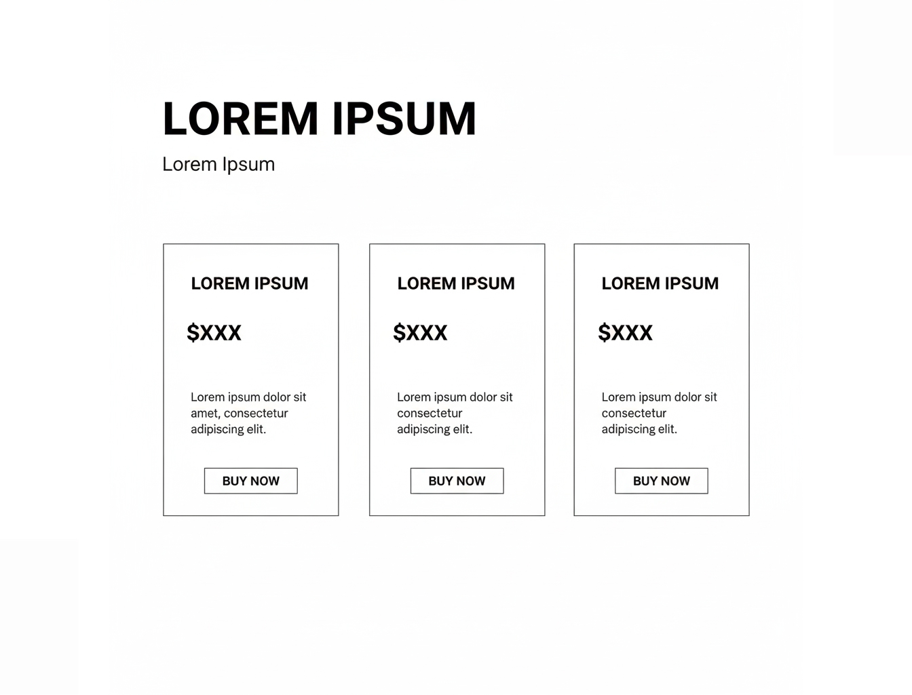

# Pricing Section - Savheera Jewelry Landing Page

## Target file implementasi (akan dibuat)

`src/app/bonus/landingpageTemplate/savheera/sections/SavheeraPricing.js`

**Database Update (WAJIB):**
Setiap kali section JavaScript dibuat, WAJIB update `src/app/bonus/landingpageTemplate/savheera/database/SavheeraDatabase.js` dengan data structure yang sesuai konsep ini.

## Wireframe Layout Reference



**Key Layout Notes:**

- Pricing cards dengan tiered layout (3 tier)
- Featured/Recommended card dengan highlight
- Desktop: 3 kolom side-by-side
- Mobile: single column stacked
- Setiap card: harga + fitur + CTA

---

## Purpose & Goals

Menampilkan struktur harga dan pilihan produk Savheera dengan cara yang elegan dan mudah dipahami. Section ini membantu pelanggan memilih opsi yang sesuai dengan budget dan kebutuhan mereka, sambil menekankan nilai dan kualitas yang didapatkan. Tujuannya adalah membuat pricing terlihat accessible dan valuable tanpa terkesan murahan.

---

## Content Structure

### Mandatory Elements:

- **Section Badge**: Label untuk identifikasi section
- **Headline**: Judul utama tentang investasi keindahan
- **Subtitle**: Penjelasan singkat tentang nilai dan kualitas
- **Pricing Cards** (3 tiers):
  - Tier name (contoh: Classic, Premium, Luxury)
  - Price display (dengan format yang jelas)
  - Description singkat tentang tier
  - Feature list (4-6 items per tier)
  - CTA button (primary untuk featured tier)
- **Optional**: Comparison chart atau additional info

### Optional Elements:

- Discount atau promo banner
- FAQ singkat tentang pricing
- Trust indicators (garansi, free shipping)
- Custom consultation CTA

---

## Copywriting Guidelines

### Tone & Voice:

- **Value-focused**: Menekankan nilai, bukan harga murah
- **Elegant & Premium**: Bahasa yang sophisticated
- **Transparent**: Jelas tentang apa yang didapatkan
- **Aspirational**: Menghubungkan harga dengan keindahan abadi

### Example Headlines:

- "Investasi dalam Keindahan Abadi"
- "Pilihan Elegan untuk Setiap Momen"
- "Nilai yang Sebanding dengan Keindahan"

### Tier Names:

- "Classic Collection" - Entry level
- "Premium Selection" - Mid-range
- "Luxury Exclusive" - High-end

### Price Display Format:

- "Mulai dari Rp 2.500.000"
- "Investasi Rp 5.000.000+"
- "Custom Quote"

### Feature Examples:

- "Material 18K Gold Certified"
- "Design Eksklusif Limited Edition"
- "Garansi Seumur Hidup"
- "Free Cleaning Service"
- "Personal Consultation"
- "International Warranty"

### CTA Examples:

- "Pilih Classic"
- "Jelajahi Premium"
- "Konsultasi Luxury"

---

## Visual & Imagery Guidelines

### Card Design:

- Featured tier: Gold accent border atau background
- Regular tiers: Clean white dengan subtle shadow
- Hierarchy melalui size dan visual weight
- Konsisten spacing dan alignment

### Price Display:

- Font size yang proporsional (bigger untuk featured)
- Color: Deep Navy untuk regular, Gold untuk featured
- Clean typography, tidak cluttered

### Icons:

- Checkmarks untuk included features
- Subtle, elegant style
- Gold atau Deep Navy color

---

## Styling & Layout

### Container:

- Max-width: 1200px (centered)
- Padding: 80px 20px (desktop), 60px 16px (mobile)
- Background: Ivory atau very light Champagne

### Grid Layout:

```jsx
// Desktop (3 columns)
<div className="grid grid-cols-1 md:grid-cols-3 gap-8">

// Mobile (1 column)
<div className="space-y-6">
```

### Card Design:

```jsx
// Regular tier
<div className="bg-white rounded-xl shadow-lg p-8 hover:shadow-xl transition-all">

// Featured tier
<div className="bg-linear-to-br from-amber-50 to-white border-2 border-amber-200 rounded-xl shadow-xl p-8 transform scale-105">
```

### Price Display:

```jsx
<div className="text-center mb-6">
  <h3 className="text-xl font-semibold mb-2">{tierName}</h3>
  <div className="text-4xl font-serif text-primary">{price}</div>
  <p className="text-sm opacity-70 mt-2">{description}</p>
</div>
```

### Typography:

- Headline: `text-3xl md:text-4xl font-serif`
- Tier Name: `text-xl font-semibold`
- Price: `text-3xl md:text-4xl font-serif text-primary`
- Features: `text-base`
- Color: `text-base-content`

---

## Animation & Interactions

### On Scroll:

- AOS fade-up untuk cards
- Stagger animation (delay bertahap)
- Featured card dapat delay lebih panjang

### Hover Effects:

- Subtle shadow enhancement
- Transform scale untuk featured tier
- Smooth transition (300ms)

### CTA Interactions:

- Hover state dengan color change
- Active state feedback
- Smooth transitions

---

## Accessibility

### Alt Text:

- Icons: "Included feature" atau similar
- Visual elements: Deskripsi fungsional

### Keyboard Navigation:

- Cards dapat di-focus
- CTA buttons accessible
- Tab order yang logical

### Screen Readers:

- Proper heading hierarchy
- ARIA labels untuk interactive elements
- Semantic HTML5 structure
- Price information clearly announced

---

## Performance Optimization

### Images:

- Jika menggunakan product images: WebP/AVIF
- Lazy loading untuk below fold
- Proper sizing

### Animation:

- CSS transforms untuk smooth performance
- GPU-accelerated properties
- Minimal JavaScript

---

## Data-Driven Implementation

### Data Structure (dari SavheeraDatabase.js):

```javascript
pricing: {
  badge: "Investasi Keindahan",
  headline: "Pilihan Elegan untuk Setiap Momen",
  subtitle: "Setiap piece adalah investasi dalam keindahan abadi",
  featuredTier: "premium", // tier id yang featured
  tiers: [
    {
      id: "classic",
      name: "Classic Collection",
      price: "Mulai dari Rp 2.500.000",
      description: "Elegansi timeless untuk daily wear",
      features: [
        "Material 14K Gold",
        "Design Ready-to-Wear",
        "Standard Warranty",
        "Free Gift Box"
      ],
      cta: {
        text: "Jelajahi Classic",
        href: "/collection/classic"
      },
      featured: false
    },
    {
      id: "premium",
      name: "Premium Selection",
      price: "Mulai dari Rp 5.000.000",
      description: "Craftsmanship premium untuk special occasions",
      features: [
        "Material 18K Gold Certified",
        "Design Eksklusif Limited",
        "Extended Warranty 5 Tahun",
        "Free Cleaning Service",
        "Personal Consultation"
      ],
      cta: {
        text: "Jelajahi Premium",
        href: "/collection/premium"
      },
      featured: true
    },
    {
      id: "luxury",
      name: "Luxury Exclusive",
      price: "Custom Quote",
      description: "Masterpiece untuk extraordinary moments",
      features: [
        "Material 22K Gold & Platinum",
        "Bespoke Design Service",
        "Lifetime Warranty",
        "VIP Concierge Service",
        "International Atelier Access",
        "Investment Documentation"
      ],
      cta: {
        text: "Konsultasi Luxury",
        href: "/contact/luxury"
      },
      featured: false
    }
  ],
  additionalInfo: {
    title: "Mengapa Investasi Savheera?",
    points: [
      "Value retention hingga 85%",
      "Design timeless tidak ketinggalan zaman",
      "Craftsmanship bersertifikat internasional"
    ]
  }
}
```

### Component Usage:

```jsx
import { savheeraData } from "../database/SavheeraDatabase.js";

// Di dalam component
const { pricing } = savheeraData;

// Render pricing cards
{
  pricing.tiers.map((tier) => <PricingCard key={tier.id} data={tier} featured={pricing.featuredTier === tier.id} />);
}
```

---

## Implementation Notes

### Responsive Considerations:

- Mobile: Single column, featured tier tetap highlighted
- Tablet: 2 columns atau 3 columns dengan 调整
- Desktop: 3 columns optimal

### DaisyUI Classes:

- Card components: `card card-compact`
- Button: `btn btn-primary` untuk featured
- Badge: `badge badge-primary`
- Shadow: `shadow-lg hover:shadow-xl`

### CSS Custom Properties:

```css
:root {
  --pricing-card-padding: 32px;
  --pricing-card-radius: 16px;
  --featured-scale: 1.05;
  --price-font-size: 2.5rem;
}
```

---

## Testing Requirements

### Visual Testing:

- Layout consistency di semua breakpoints
- Featured tier highlight visible
- Price formatting consistent

### Content Testing:

- Text tidak overflow
- Feature list formatting consistent
- CTA buttons accessible

### Performance:

- Lighthouse score >90
- Smooth animations
- Fast load time

---

## Related Files

- Database: `src/app/bonus/landingpageTemplate/savheera/database/SavheeraDatabase.js`
- Implementation Guide: `concept/07-implementation.md`
- Brand Guidelines: `concept/00-overview/brand-guidelines.md`
- Color Palette: `concept/03-design/color-palette.md`
- Typography: `concept/03-design/typography.md`
