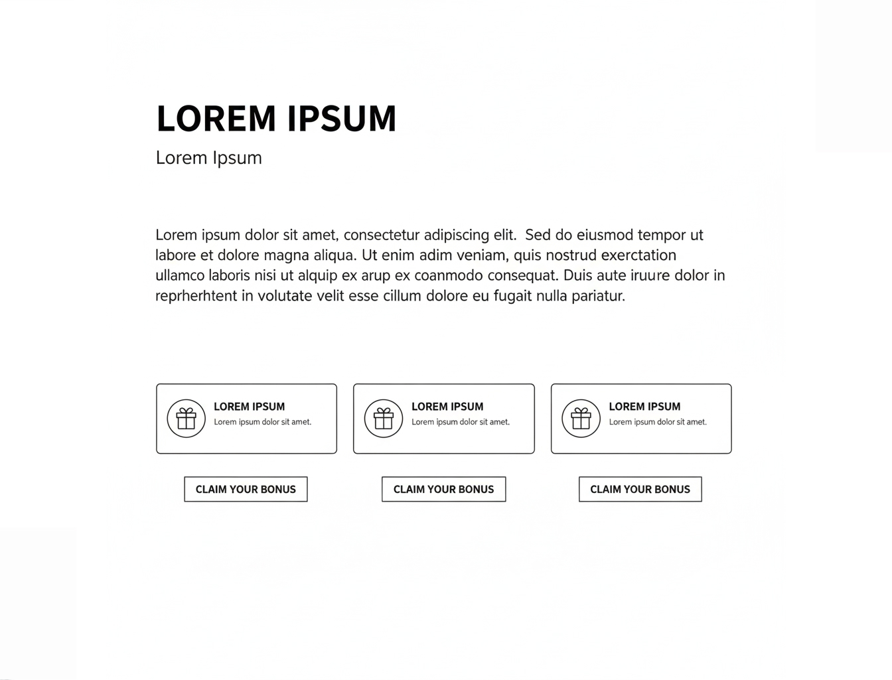

# Bonus Section - Savheera Jewelry Landing Page

## Target file implementasi (akan dibuat)

`src/app/bonus/landingpageTemplate/savheera/sections/SavheeraBonus.js`

**Database Update (WAJIB):**
Setiap kali section JavaScript dibuat, WAJIB update `src/app/bonus/landingpageTemplate/savheera/database/SavheeraDatabase.js` dengan data structure yang sesuai konsep ini.

## Wireframe Layout Reference



**Key Layout Notes:**

- Limited-time offer banner dengan countdown timer
- Bonus items grid (2-3 items)
- Urgency elements (scarcity, deadline)
- Desktop: 2-3 kolom, Mobile: single column
- Highlight visual untuk special offer

---

## Purpose & Goals

Menciptakan urgency dan incentive untuk pembelian segera melalui penawaran eksklusif terbatas. Section ini meningkatkan conversion rate dengan menampilkan nilai tambah yang hanya tersedia untuk periode tertentu. Tujuannya adalah mendorong action tanpa mengorbankan kesan elegan dan premium brand Savheera.

---

## Content Structure

### Mandatory Elements:

- **Urgency Banner**: Countdown timer + deadline info
- **Section Badge**: "Limited Offer" atau similar
- **Headline**: Judul utama tentang special bonus
- **Subtitle**: Penjelasan singkat tentang nilai tambah
- **Bonus Items Grid** (2-3 items):
  - Item image atau visual representation
  - Item name dan description
  - Value proposition (harga normal vs gratis)
  - Quantity atau availability indicator
- **Primary CTA**: Tombol utama untuk claim bonus
- **Terms**: Syarat dan ketentuan singkat

### Optional Elements:

- Progress bar (stock remaining)
- Social proof (X orang sudah claim)
- Additional benefits list
- Comparison dengan regular purchase

---

## Copywriting Guidelines

### Tone & Voice:

- **Exclusive & Urgent**: Teras spesial dan limited
- **Value-driven**: Menekankan benefit, bukan discount
- **Elegant Pressure**: Gentle urgency tanpa aggressive
- **Appreciative**: Menghargai customer dengan bonus

### Example Headlines:

- "Special Gift untuk Momen Spesial Anda"
- "Limited Time: Exclusive Bonus Collection"
- "Celebrate dengan Extra Elegance"

### Urgency Messages:

- "Hanya 3 Hari Lagi"
- "Limited Stock: Tersedia 20 Set Saja"
- "Claim Sebelum [Date]"

### Bonus Item Examples:

- "Free Diamond Cleaning Kit (Rp 500.000 value)"
- "Exclusive Jewelry Box Premium"
- "Personal Styling Session (1 hour)"
- "Extended Warranty +1 Tahun"

### CTA Examples:

- "Claim My Bonus Now"
- "Get This Limited Offer"
- "Secure My Exclusive Gift"

### Terms Examples:

- _"Berlaku untuk pembelian minimum Rp 5.000.000"_
- _"Selama stock tersedia"_
- _"Tidak dapat digabung dengan promo lain"_

---

## Visual & Imagery Guidelines

### Countdown Timer:

- Style: Elegant, digital display
- Color: Gold atau Deep Navy
- Background: Subtle, tidak mengganggu
- Font: Clean, modern, readable

### Bonus Items:

- High-quality product photography
- Lifestyle context (penggunaan nyata)
- Consistent lighting dan background
- Focus pada value dan quality

### Urgy Elements:

- Progress bars dengan smooth animations
- Stock indicators dengan visual appeal
- Timer dengan clear visibility

---

## Styling & Layout

### Container:

- Max-width: 1200px (centered)
- Padding: 80px 20px (desktop), 60px 16px (mobile)
- Background: Champagne gradient atau soft pattern

### Grid Layout:

```jsx
// Desktop (2-3 columns)
<div className="grid grid-cols-1 md:grid-cols-2 lg:grid-cols-3 gap-8">

// Mobile (1 column)
<div className="space-y-6">
```

### Urgency Banner:

```jsx
<div className="bg-linear-to-r from-amber-100 to-amber-50 border border-amber-200 rounded-xl p-6 mb-8">
  <div className="flex flex-col md:flex-row items-center justify-between">
    <div>
      <h3 className="text-lg font-semibold text-amber-900">Limited Time Offer</h3>
      <p className="text-amber-700">Berakhir dalam:</p>
    </div>
    <CountdownTimer target={endDate} />
  </div>
</div>
```

### Bonus Card Design:

```jsx
<div className="bg-white rounded-xl shadow-lg overflow-hidden hover:shadow-xl transition-all">
  <div className="aspect-video bg-linear-to-br from-amber-50 to-white flex items-center justify-center">{/* Bonus item image/icon */}</div>
  <div className="p-6">
    <h4 className="text-xl font-semibold mb-2">{itemName}</h4>
    <p className="text-base opacity-80 mb-4">{description}</p>
    <div className="flex items-center justify-between">
      <span className="text-sm line-through opacity-60">{originalValue}</span>
      <span className="text-lg font-semibold text-primary">FREE</span>
    </div>
  </div>
</div>
```

### Typography:

- Headline: `text-3xl md:text-4xl font-serif`
- Item Name: `text-xl font-semibold`
- Description: `text-base opacity-80`
- CTA: `text-lg font-medium`
- Color: `text-base-content`

---

## Animation & Interactions

### Countdown Timer:

- Real-time update setiap second
- Smooth number transitions
- Pulsing effect saat deadline dekat

### On Scroll:

- AOS fade-up untuk bonus cards
- Stagger animation (delay bertahap)
- Urgency banner fade-in pertama

### Hover Effects:

- Cards: Subtle lift dan shadow enhancement
- CTA: Color change dan scale
- Timer: Subtle glow effect

### Stock Animation:

- Progress bar fill animation
- Number counting effect
- Smooth transitions

---

## Accessibility

### Alt Text:

- Bonus item images: Deskripsi value dan benefit
- Timer elements: "Countdown timer showing time remaining"

### Keyboard Navigation:

- Cards dapat di-focus
- CTA buttons accessible
- Timer accessible untuk screen readers

### Screen Readers:

- Proper heading hierarchy
- ARIA labels untuk interactive elements
- Timer announcements setiap menit
- Semantic HTML5 structure

---

## Performance Optimization

### Images:

- WebP/AVIF format untuk bonus items
- Lazy loading untuk below fold
- Proper sizing dan compression

### Timer Performance:

- Efficient countdown logic
- Minimal re-renders
- Optimized interval management

### Animation:

- CSS transforms untuk smooth performance
- GPU-accelerated properties
- Minimal JavaScript overhead

---

## Data-Driven Implementation

### Data Structure (dari SavheeraDatabase.js):

```javascript
bonus: {
  urgency: {
    enabled: true,
    type: "countdown", // atau "stock"
    deadline: "2024-02-28T23:59:59",
    message: "Berakhir dalam:",
    stockRemaining: 15,
    maxStock: 20
  },
  badge: "Limited Offer",
  headline: "Special Gift untuk Momen Spesial",
  subtitle: "Dapatkan exclusive bonus hanya untuk pembelian periode ini",
  items: [
    {
      id: 1,
      name: "Diamond Cleaning Kit Premium",
      description: "Complete cleaning set untuk maintenance perhiasan Anda",
      image: "/images/bonus/cleaning-kit.jpg",
      originalValue: "Rp 500.000",
      currentValue: "FREE",
      category: "care",
      availability: "unlimited"
    },
    {
      id: 2,
      name: "Exclusive Jewelry Box",
      description: "Luxury storage box dengan velvet lining dan security lock",
      image: "/images/bonus/jewelry-box.jpg",
      originalValue: "Rp 750.000",
      currentValue: "FREE",
      category: "storage",
      availability: "limited"
    },
    {
      id: 3,
      name: "Personal Styling Session",
      description: "1-hour consultation dengan jewelry expert kami",
      image: "/images/bonus/styling-session.jpg",
      originalValue: "Rp 1.000.000",
      currentValue: "FREE",
      category: "service",
      availability: "limited"
    }
  ],
  cta: {
    text: "Claim My Bonus Now",
    href: "/checkout",
    primary: true
  },
  terms: {
    title: "Syarat & Ketentuan",
    points: [
      "Berlaku untuk pembelian minimum Rp 5.000.000",
      "Selama stock tersedia",
      "Tidak dapat digabung dengan promo lain",
      "Berlaku hingga 28 Februari 2024"
    ]
  },
  socialProof: {
    enabled: true,
    message: "{count} pelanggan sudah claim bonus ini",
    count: 127
  }
}
```

### Component Usage:

```jsx
import { savheeraData } from "../database/SavheeraDatabase.js";
import CountdownTimer from "../ui-components/CountdownTimer.js";

// Di dalam component
const { bonus } = savheeraData;

// Render bonus items
{
  bonus.items.map((item) => <BonusCard key={item.id} data={item} />);
}
```

---

## Implementation Notes

### Responsive Considerations:

- Mobile: Single column, timer di atas
- Tablet: 2 columns untuk optimal viewing
- Desktop: 3 columns jika ada 3 items

### DaisyUI Classes:

- Card components: `card card-compact`
- Button: `btn btn-primary`
- Badge: `badge badge-warning`
- Alert: `alert alert-warning` untuk urgency

### CSS Custom Properties:

```css
:root {
  --bonus-card-padding: 24px;
  --bonus-card-radius: 16px;
  --countdown-font-size: 2rem;
  --urgency-bg-gradient: linear-gradient(135deg, #fbbf24, #fef3c7);
}
```

---

## Testing Requirements

### Visual Testing:

- Layout consistency di semua breakpoints
- Timer accuracy dan display
- Stock indicators correct

### Functionality Testing:

- Countdown timer works correctly
- CTA buttons functional
- Form validation (jika ada)

### Performance:

- Lighthouse score >90
- Timer tidak mengganggu performance
- Smooth animations

---

## Related Files

- Database: `src/app/bonus/landingpageTemplate/savheera/database/SavheeraDatabase.js`
- Implementation Guide: `concept/07-implementation.md`
- Brand Guidelines: `concept/00-overview/brand-guidelines.md`
- Color Palette: `concept/03-design/color-palette.md`
- Animation: `concept/03-design/animation.md`
