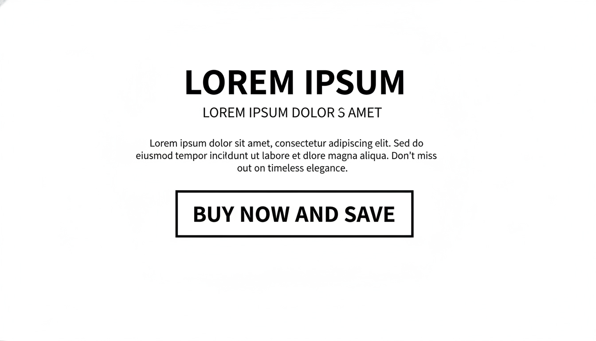

# CTA Section - Savheera Jewelry Landing Page

## Target file implementasi (akan dibuat)

`src/app/bonus/landingpageTemplate/savheera/sections/SavheeraCTA.js`

**Database Update (WAJIB):**
Setiap kali section JavaScript dibuat, WAJIB update `src/app/bonus/landingpageTemplate/savheera/database/SavheeraDatabase.js` dengan data structure yang sesuai konsep ini.

## Wireframe Layout Reference



**Key Layout Notes:**

- Full-width section dengan background gradient
- Centered content layout
- Primary CTA button yang prominent
- Desktop: wide container, Mobile: compact
- Visual hierarchy dengan headline + CTA

---

## Purpose & Goals

Memberikan call-to-action final yang mengkonversi pengunjung menjadi pelanggan. Section ini adalah titik decision terakhir di landing page, harus memberikan clarity dan confidence untuk mengambil langkah selanjutnya. Tujuannya adalah menciptakan sense of urgency dan excitement tanpa pressure yang berlebihan.

---

## Content Structure

### Mandatory Elements:

- **Section Badge**: Label untuk identifikasi section
- **Headline**: Judul utama yang compelling dan action-oriented
- **Subtitle**: Penjelasan singkat tentang next step
- **Primary CTA Button**: Tombol utama untuk conversion
- **Secondary CTA**: Opsional, untuk alternative action
- **Trust Indicators**: Garansi, free shipping, dll

### Optional Elements:

- Social proof counter
- Limited availability message
- Contact information
- Video atau visual enhancement

---

## Copywriting Guidelines

### Tone & Voice:

- **Confident & Assuring**: Memberikan kepercayaan diri
- **Inviting**: Welcome dan friendly
- **Clear & Direct**: Tidak ambigu tentang action
- **Aspirational**: Menghubungkan dengan keindahan dan momen

### Example Headlines:

- "Temukan Keindahan yang Menanti Anda"
- "Waktunya untuk Momen Berharga"
- "Langkah Pertama Menuju Elegansi Abadi"

### Subtitle Examples:

- "Konsultasi gratis dengan jewelry expert kami"
- "Jelajahi koleksi eksklusif yang dibuat khusus untuk Anda"
- "Transform momen spesial Anda dengan perhiasan sempurna"

### Primary CTA Examples:

- "Jelajahi Koleksi Sekarang"
- "Mulai Konsultasi Gratis"
- "Temukan Perhiasan Sempurna"

### Secondary CTA Examples:

- "Lihat Katalog Lengkap"
- "Hubungi Expert Kami"
- "Download Lookbook"

---

## Visual & Imagery Guidelines

### Background:

- Style: Elegant gradient (Ivory to Champagne)
- Subtle: Tidak mengganggu readability
- Full-width: Menciptakan impact visual

### Button Design:

- Primary: Gold background dengan white text
- Secondary: Outline style dengan gold border
- Size: Large dan prominent
- Shape: Rounded dengan smooth corners

### Visual Elements:

- Opsional: Subtle jewelry illustrations
- Icon: Elegant indicators untuk trust
- Typography: Hierarchy yang jelas

---

## Styling & Layout

### Container:

- Full-width section
- Padding: 100px 20px (desktop), 80px 16px (mobile)
- Background: Gradient dari Ivory ke Champagne
- Text centering untuk focus

### Layout Structure:

```jsx
<div className="w-full py-20 bg-linear-to-r from-ivory to-champagne">
  <div className="max-w-4xl mx-auto text-center px-4">
    {/* Badge */}
    {/* Headline */}
    {/* Subtitle */}
    {/* CTA Buttons */}
    {/* Trust Indicators */}
  </div>
</div>
```

### Typography:

- Headline: `text-4xl md:text-5xl font-serif`
- Subtitle: `text-xl md:text-2xl opacity-90`
- CTA: `text-lg font-medium`
- Color: `text-base-content`

### Button Design:

```jsx
// Primary CTA
<button className="btn btn-lg bg-primary text-white hover:bg-primary/90 transform hover:scale-105 transition-all">
  {ctaText}
</button>

// Secondary CTA
<button className="btn btn-lg btn-outline border-primary text-primary hover:bg-primary hover:text-white">
  {secondaryText}
</button>
```

---

## Animation & Interactions

### On Scroll:

- AOS fade-up untuk content
- Stagger animation untuk elements
- Smooth entrance effect

### Button Interactions:

- Hover: Scale effect dan color transition
- Active: Subtle press effect
- Focus: Clear outline untuk accessibility

### Background Animation:

- Subtle gradient animation (opsional)
- Gentle movement untuk visual interest

---

## Accessibility

### Button Accessibility:

- Clear ARIA labels
- Keyboard navigation support
- Focus indicators visible
- Screen reader announcements

### Content Structure:

- Proper heading hierarchy
- Semantic HTML5 elements
- Alt text untuk visual elements
- Color contrast compliance

### Navigation:

- Logical tab order
- Skip links jika needed
- Clear focus management

---

## Performance Optimization

### Images:

- Jika menggunakan background images: WebP/AVIF
- Proper sizing dan compression
- Lazy loading jika below fold

### Animation:

- CSS transforms untuk smooth performance
- GPU-accelerated properties
- Minimal JavaScript overhead

### Loading:

- Critical CSS inline
- Non-critical styles deferred
- Optimized font loading

---

## Data-Driven Implementation

### Data Structure (dari SavheeraDatabase.js):

```javascript
cta: {
  badge: "Ready to Begin?",
  headline: "Temukan Keindahan yang Menanti Anda",
  subtitle: "Konsultasi gratis dengan jewelry expert kami untuk menemukan perhiasan sempurna untuk momen spesial Anda",
  primaryCTA: {
    text: "Mulai Konsultasi Gratis",
    href: "/consultation",
    type: "primary"
  },
  secondaryCTA: {
    text: "Lihat Katalog Lengkap",
    href: "/catalog",
    type: "secondary"
  },
  trustIndicators: [
    {
      icon: "shield",
      text: "Garansi Kualitas 100%"
    },
    {
      icon: "truck",
      text: "Free Shipping Worldwide"
    },
    {
      icon: "award",
      text: "Certified Materials"
    }
  ],
  socialProof: {
    enabled: true,
    message: "Bergabung dengan {count}+ pelanggan bahagia",
    count: 5000
  },
  urgency: {
    enabled: false,
    message: "Slot konsultasi terbatas hari ini"
  }
}
```

### Component Usage:

```jsx
import { savheeraData } from "../database/SavheeraDatabase.js";

// Di dalam component
const { cta } = savheeraData;

// Render trust indicators
{
  cta.trustIndicators.map((indicator, index) => <TrustIndicator key={index} data={indicator} />);
}
```

---

## Implementation Notes

### Responsive Considerations:

- Mobile: Compact layout dengan larger buttons
- Tablet: Balanced spacing
- Desktop: Full-width impact

### DaisyUI Classes:

- Button: `btn btn-lg btn-primary`
- Badge: `badge badge-primary`
- Alert: `alert alert-success` untuk trust indicators

### CSS Custom Properties:

```css
:root {
  --cta-section-padding: 5rem;
  --cta-button-size: 1.125rem;
  --cta-gradient-start: #faf7f0;
  --cta-gradient-end: #f5e6d3;
}
```

---

## Testing Requirements

### Visual Testing:

- Layout consistency di semua breakpoints
- Button states (hover, active, focus)
- Text readability pada gradient background

### Functionality Testing:

- CTA buttons functional
- Form validation (jika ada)
- Navigation flows correctly

### Performance:

- Lighthouse score >90
- Fast load time
- Smooth animations

---

## Related Files

- Database: `src/app/bonus/landingpageTemplate/savheera/database/SavheeraDatabase.js`
- Implementation Guide: `concept/07-implementation.md`
- Brand Guidelines: `concept/00-overview/brand-guidelines.md`
- Color Palette: `concept/03-design/color-palette.md`
- Animation: `concept/03-design/animation.md`
