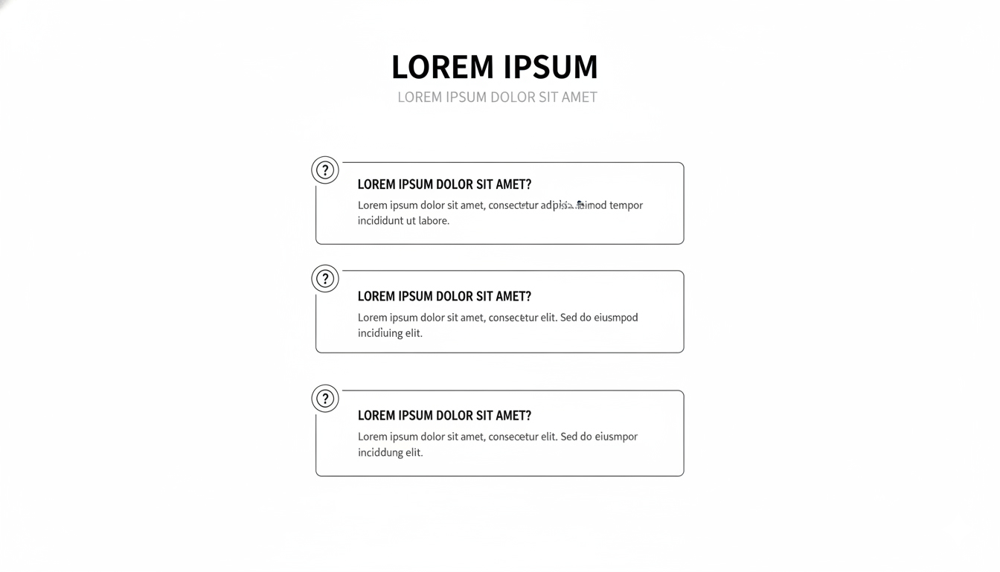

# FAQ Section - Savheera Jewelry Landing Page

## Target file implementasi (akan dibuat)

`src/app/bonus/landingpageTemplate/savheera/sections/SavheeraFAQ.js`

**Database Update (WAJIB):**
Setiap kali section JavaScript dibuat, WAJIB update `src/app/bonus/landingpageTemplate/savheera/database/SavheeraDatabase.js` dengan data structure yang sesuai konsep ini.

## Wireframe Layout Reference



**Key Layout Notes:**

- Accordion-style FAQ items
- 2-column layout (desktop) untuk better readability
- Mobile: single column stacked
- Expandable/collapsible items dengan smooth animation
- Search atau category filter (opsional)

---

## Purpose & Goals

Menjawab pertanyaan umum dan menghilangkan keraguan pelanggan tentang produk, layanan, dan proses pembelian. Section ini mengurangi friction dan meningkatkan confidence dengan memberikan informasi yang jelas dan mudah diakses. Tujuannya adalah memberikan clarity tanpa overwhelming pengguna.

---

## Content Structure

### Mandatory Elements:

- **Section Badge**: Label untuk identifikasi section
- **Headline**: Judul utama tentang frequently asked questions
- **Subtitle**: Penjelasan singkat tentang help availability
- **FAQ Items** (6-10 items):
  - Question (clear dan concise)
  - Answer (comprehensive tapi tidak panjang)
  - Expand/collapse functionality
- **Contact CTA**: Link ke customer support untuk additional help

### Optional Elements:

- Search bar untuk filter FAQs
- Category tabs (Product, Shipping, Returns, etc.)
- "Still have questions?" section
- Live chat widget integration

---

## Copywriting Guidelines

### Tone & Voice:

- **Helpful & Informative**: Memberikan value dan clarity
- **Professional & Caring**: Menunjukkan expertise dan empathy
- **Clear & Concise**: Tidak verbose, langsung ke point
- **Reassuring**: Membangun trust dan confidence

### Example Headlines:

- "Pertanyaan yang Sering Diajukan"
- "Temukan Jawaban yang Anda Cari"
- "Bantuan dan Informasi Penting"

### Question Examples:

- "Bagaimana cara memilih ukuran cincin yang tepat?"
- "Apakah perhiasan Savheera tersertifikasi?"
- "Berapa lama proses pengiriman?"
- "Bagaimana cara merawat perhiasan saya?"
- "Apakah ada garansi untuk produk Savheera?"
- "Bisakah saya custom design perhiasan?"

### Answer Guidelines:

- Direct dan to the point
- Include relevant details tanpa overwhelming
- Use bullet points untuk complex information
- Include links ke relevant pages jika needed

### CTA Examples:

- "Butuh Bantuan Lainnya? Hubungi Kami"
- "Chat dengan Expert Kami"
- "Kirim Pertanyaan Anda"

---

## Visual & Imagery Guidelines

### Accordion Design:

- Clean dan minimalis
- Clear visual hierarchy
- Smooth expand/collapse animations
- Icon indicators (+/- atau chevron)

### Layout:

- Desktop: 2 columns untuk optimal reading
- Mobile: Single column dengan proper spacing
- Consistent item heights dan alignment

### Visual Elements:

- Subtle borders atau dividers
- Hover states untuk interactive elements
- Focus indicators untuk accessibility

---

## Styling & Layout

### Container:

- Max-width: 1000px (centered)
- Padding: 80px 20px (desktop), 60px 16px (mobile)
- Background: Ivory atau white
- Clean dan organized layout

### Grid Layout:

```jsx
// Desktop (2 columns)
<div className="grid grid-cols-1 md:grid-cols-2 gap-6">

// Mobile (1 column)
<div className="space-y-4">
```

### Accordion Item Design:

```jsx
<div className="bg-white rounded-lg border border-neutral-200 overflow-hidden">
  <button className="w-full px-6 py-4 text-left flex items-center justify-between hover:bg-neutral-50 transition-colors">
    <span className="font-medium">{question}</span>
    <ChevronDown className="w-5 h-5 transform transition-transform" />
  </button>
  <div className="px-6 pb-4 text-neutral-600">{answer}</div>
</div>
```

### Typography:

- Headline: `text-3xl md:text-4xl font-serif`
- Question: `text-lg font-medium`
- Answer: `text-base opacity-80`
- CTA: `text-base font-medium`
- Color: `text-base-content`

---

## Animation & Interactions

### Accordion Animations:

- Smooth expand/collapse dengan CSS transitions
- Icon rotation untuk open/close states
- Stagger animation untuk initial load

### Hover Effects:

- Subtle background color change
- Icon color transitions
- Smooth state changes (300ms)

### On Scroll:

- AOS fade-up untuk FAQ items
- Stagger animation untuk visual interest
- Smooth entrance effects

---

## Accessibility

### Keyboard Navigation:

- Full keyboard accessibility untuk accordion
- Tab order yang logical
- Focus indicators visible
- Enter/Space untuk expand/collapse

### Screen Readers:

- Proper ARIA attributes (aria-expanded, aria-controls)
- Semantic HTML5 structure
- Clear heading hierarchy
- Announce state changes

### Visual Accessibility:

- Sufficient color contrast
- Clear focus indicators
- Large enough click targets
- Text readability

---

## Performance Optimization

### Animation Performance:

- CSS transforms untuk smooth animations
- GPU-accelerated properties
- Minimal JavaScript overhead

### Content Loading:

- Lazy loading untuk below fold content
- Optimized image loading (jika ada)
- Efficient state management

### Bundle Optimization:

- Tree shaking untuk unused code
- Code splitting jika needed
- Optimized dependencies

---

## Data-Driven Implementation

### Data Structure (dari SavheeraDatabase.js):

```javascript
faq: {
  badge: "Pusat Bantuan",
  headline: "Pertanyaan yang Sering Diajukan",
  subtitle: "Temukan jawaban untuk pertanyaan umum tentang produk dan layanan kami",
  categories: [
    {
      id: "product",
      name: "Produk",
      icon: "gem"
    },
    {
      id: "shipping",
      name: "Pengiriman",
      icon: "truck"
    },
    {
      id: "returns",
      name: "Pengembalian",
      icon: "arrow-rotate-left"
    },
    {
      id: "care",
      name: "Perawatan",
      icon: "heart"
    }
  ],
  items: [
    {
      id: 1,
      category: "product",
      question: "Bagaimana cara memilih ukuran cincin yang tepat?",
      answer: "Kami menyediakan panduan ukuran lengkap di website. Anda juga dapat mengunjungi store kami untuk pengukuran gratis. Untuk ukuran custom, kami menyediakan konsultasi dengan jewelry expert kami.",
      expanded: false
    },
    {
      id: 2,
      category: "product",
      question: "Apakah perhiasan Savheera tersertifikasi?",
      answer: "Ya, semua perhiasan Savheera dilengkapi dengan sertifikat keaslian dari lembaga terpercaya. Material kami bersertifikat internasional dan garansi keaslian 100%.",
      expanded: false
    },
    {
      id: 3,
      category: "shipping",
      question: "Berapa lama proses pengiriman?",
      answer: "Pengiriman regular memakan waktu 3-5 hari kerja untuk area Jabodetabek dan 5-7 hari kerja untuk luar Jabodetabek. Kami juga menyediakan ekspres delivery untuk kebutuhan mendesak.",
      expanded: false
    },
    {
      id: 4,
      category: "care",
      question: "Bagaimana cara merawat perhiasan saya?",
      answer: "Simpan perhiasan di tempat yang kering dan terpisah. Hindari kontak dengan bahan kimia. Lakukan cleaning rutin di store kami gratis untuk pelanggan setia. Panduan lengkap tersedia di setiap pembelian.",
      expanded: false
    },
    {
      id: 5,
      category: "returns",
      question: "Apakah ada garansi untuk produk Savheera?",
      answer: "Kami memberikan garansi 1 tahun untuk manufacturing defects. Extended warranty tersedia untuk produk premium. Garansi tidak cover damage karena penggunaan yang tidak proper.",
      expanded: false
    },
    {
      id: 6,
      category: "product",
      question: "Bisakah saya custom design perhiasan?",
      answer: "Ya, kami melayani custom design untuk special occasions. Proses konsultasi dimulai dari 2-4 minggu tergantung complexity. Hubungi kami untuk konsultasi gratis.",
      expanded: false
    }
  ],
  contact: {
    title: "Masih Punya Pertanyaan?",
    subtitle: "Tim kami siap membantu Anda",
    cta: {
      text: "Hubungi Customer Service",
      href: "/contact",
      type: "primary"
    },
    channels: [
      {
        type: "phone",
        label: "WhatsApp",
        value: "+62 812-3456-7890",
        href: "https://wa.me/6281234567890"
      },
      {
        type: "email",
        label: "Email",
        value: "care@savheera.com",
        href: "mailto:care@savheera.com"
      },
      {
        type: "chat",
        label: "Live Chat",
        value: "Available 9 AM - 9 PM",
        href: "#"
      }
    ]
  }
}
```

### Component Usage:

```jsx
import { savheeraData } from "../database/SavheeraDatabase.js";
import { useState } from "react";

// Di dalam component
const { faq } = savheeraData;
const [expandedItems, setExpandedItems] = useState(new Set());

// Render FAQ items
{
  faq.items.map((item) => <FAQItem key={item.id} data={item} expanded={expandedItems.has(item.id)} onToggle={() => toggleItem(item.id)} />);
}
```

---

## Implementation Notes

### Responsive Considerations:

- Mobile: Single column dengan proper spacing
- Tablet: 2 columns untuk better readability
- Desktop: 2 columns optimal

### DaisyUI Classes:

- Accordion: `collapse collapse-arrow` atau custom implementation
- Button: `btn btn-ghost` untuk question triggers
- Divider: `divider` untuk visual separation

### CSS Custom Properties:

```css
:root {
  --faq-item-padding: 1.5rem;
  --faq-item-radius: 0.5rem;
  --faq-transition-duration: 300ms;
  --faq-icon-size: 1.25rem;
}
```

---

## Testing Requirements

### Visual Testing:

- Layout consistency di semua breakpoints
- Accordion animations smooth
- Icon states correct

### Functionality Testing:

- Expand/collapse works correctly
- Search/filter functionality (jika ada)
- Keyboard navigation complete

### Accessibility Testing:

- Screen reader compatibility
- Keyboard navigation flow
- Color contrast compliance
- Focus management

---

## Related Files

- Database: `src/app/bonus/landingpageTemplate/savheera/database/SavheeraDatabase.js`
- Implementation Guide: `concept/07-implementation.md`
- Brand Guidelines: `concept/00-overview/brand-guidelines.md`
- Color Palette: `concept/03-design/color-palette.md`
- Animation: `concept/03-design/animation.md`
