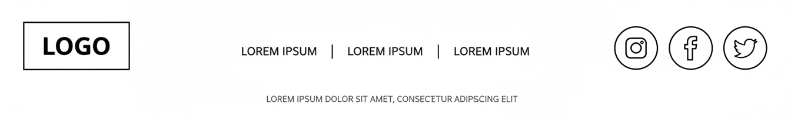

# Footer Section - Savheera Jewelry Landing Page

## Target file implementasi (akan dibuat)

`src/app/bonus/landingpageTemplate/savheera/sections/SavheeraFooter.js`

**Database Update (WAJIB):**
Setiap kali section JavaScript dibuat, WAJIB update `src/app/bonus/landingpageTemplate/savheera/database/SavheeraDatabase.js` dengan data structure yang sesuai konsep ini.

## Wireframe Layout Reference



**Key Layout Notes:**

- Multi-column layout dengan organized sections
- Brand logo dan tagline prominent
- Social media links yang elegant
- Newsletter subscription form
- Copyright dan legal links
- Mobile: stacked columns

---

## Purpose & Goals

Menyediakan navigasi lengkap dan informasi kontak yang mudah diakses. Footer ini harus mencerminkan brand elegance Savheera sambil memberikan semua essential links dan information. Tujuannya adalah menciptakan lasting impression dan provide easy access ke semua parts dari website.

---

## Content Structure

### Mandatory Elements:

- **Brand Section**: Logo, tagline, brief description
- **Quick Links**: Navigation ke main pages
- **Categories**: Product categories links
- **Customer Service**: Support links
- **Newsletter**: Email subscription form
- **Social Media**: Social platform links
- **Legal**: Copyright, privacy, terms
- **Payment Methods**: Accepted payment icons

### Optional Elements:

- Store locations
- Contact information detail
- App download buttons
- Trust badges
- Language selector

---

## Copywriting Guidelines

### Tone & Voice:

- **Professional & Elegant**: Menjaga brand consistency
- **Helpful & Informative**: Clear navigation guidance
- **Trustworthy**: Legal dan contact information
- **Inviting**: Newsletter dan social CTAs

### Tagline Examples:

- "Elegance in Every Moment"
- "Crafting Memories Since 2020"
- "Your Journey to Timeless Beauty"

### Newsletter CTA Examples:

- "Dapatkan Exclusive Offers & Tips"
- "Join Savheera Inner Circle"
- "Subscribe untuk Beauty Inspiration"

### Link Categories:

- **Quick Links**: Home, About, Collections, Contact
- **Categories**: Rings, Necklaces, Earrings, Bracelets
- **Customer Service**: FAQ, Shipping, Returns, Size Guide
- **About**: Our Story, Craftsmanship, Sustainability, Careers

---

## Visual & Imagery Guidelines

### Logo & Branding:

- Logo dalam primary color scheme
- Clean dan elegant presentation
- Consistent dengan header branding

### Social Media Icons:

- Elegant, minimalist icon style
- Consistent size dan spacing
- Hover effects yang subtle
- Brand-appropriate platforms

### Payment Icons:

- Clean, recognizable payment logos
- Organized horizontal layout
- Appropriate sizing

### Form Design:

- Clean input fields dengan proper styling
- Elegant submit button
- Clear placeholder text
- Privacy assurance text

---

## Styling & Layout

### Container:

- Full-width section
- Background: Deep Navy atau Ivory (tergantung theme)
- Padding: 60px 20px (desktop), 40px 16px (mobile)
- Clear section separation

### Grid Layout:

```jsx
// Desktop (4-5 columns)
<div className="grid grid-cols-1 md:grid-cols-2 lg:grid-cols-4 gap-8">

// Tablet (2-3 columns)
<div className="grid grid-cols-1 md:grid-cols-2 lg:grid-cols-3 gap-6">

// Mobile (1 column stacked)
<div className="space-y-8">
```

### Column Structure:

```jsx
// Brand Column
<div className="space-y-4">
  
  <p className="text-sm opacity-80">{tagline}</p>
  <div className="flex space-x-4">{socialIcons}</div>
</div>

// Links Columns
<div className="space-y-4">
  <h3 className="font-semibold text-lg">{columnTitle}</h3>
  <ul className="space-y-2">{linkItems}</ul>
</div>

// Newsletter Column
<div className="space-y-4">
  <h3 className="font-semibold text-lg">Stay Connected</h3>
  <form className="space-y-3">{newsletterForm}</form>
</div>
```

### Typography:

- Column Headers: `text-lg font-semibold`
- Links: `text-sm opacity-80 hover:opacity-100`
- Newsletter: `text-base`
- Copyright: `text-xs opacity-60`
- Color: `text-base-content` atau `text-neutral-content`

---

## Animation & Interactions

### Link Hover Effects:

- Subtle color change atau underline
- Smooth transition (200ms)
- Consistent across all links

### Form Interactions:

- Focus states pada input fields
- Button hover/active states
- Success/error feedback

### Social Media Icons:

- Scale effect pada hover
- Color transitions
- Smooth animations

---

## Accessibility

### Navigation Structure:

- Semantic HTML5 footer element
- Proper heading hierarchy
- Logical link grouping
- Clear section labels

### Form Accessibility:

- Proper labels dan placeholders
- Input validation feedback
- Screen reader announcements
- Keyboard navigation

### Link Accessibility:

- Descriptive link text
- Focus indicators visible
- Skip links jika needed
- ARIA labels untuk icons

---

## Performance Optimization

### Image Optimization:

- Optimized logo files (SVG preferred)
- Proper icon sizing
- Lazy loading untuk non-critical images
- Efficient format selection

### Bundle Optimization:

- Minimal JavaScript untuk footer
- CSS-only animations
- Optimized icon libraries
- Efficient form handling

### Loading Strategy:

- Critical CSS inline
- Non-critical styles deferred
- Progressive enhancement
- Fast initial render

---

## Data-Driven Implementation

### Data Structure (dari SavheeraDatabase.js):

```javascript
footer: {
  brand: {
    logo: "/assets/savheera-logo.svg",
    tagline: "Elegance in Every Moment",
    description: "Crafting timeless jewelry for your most precious moments.",
    social: [
      {
        platform: "instagram",
        url: "https://instagram.com/savheera",
        icon: "instagram"
      },
      {
        platform: "facebook",
        url: "https://facebook.com/savheera",
        icon: "facebook"
      },
      {
        platform: "pinterest",
        url: "https://pinterest.com/savheera",
        icon: "pinterest"
      },
      {
        platform: "youtube",
        url: "https://youtube.com/savheera",
        icon: "youtube"
      }
    ]
  },
  sections: [
    {
      title: "Quick Links",
      links: [
        { text: "Home", href: "/" },
        { text: "About Us", href: "/about" },
        { text: "Collections", href: "/collections" },
        { text: "Contact", href: "/contact" }
      ]
    },
    {
      title: "Categories",
      links: [
        { text: "Rings", href: "/collections/rings" },
        { text: "Necklaces", href: "/collections/necklaces" },
        { text: "Earrings", href: "/collections/earrings" },
        { text: "Bracelets", href: "/collections/bracelets" }
      ]
    },
    {
      title: "Customer Service",
      links: [
        { text: "FAQ", href: "/faq" },
        { text: "Shipping Info", href: "/shipping" },
        { text: "Returns", href: "/returns" },
        { text: "Size Guide", href: "/size-guide" }
      ]
    }
  ],
  newsletter: {
    title: "Stay Connected",
    description: "Get exclusive offers and beauty tips delivered to your inbox",
    placeholder: "Enter your email address",
    buttonText: "Subscribe",
    privacyText: "We respect your privacy. Unsubscribe at any time."
  },
  legal: {
    copyright: "© 2024 Savheera Jewelry. All rights reserved.",
    links: [
      { text: "Privacy Policy", href: "/privacy" },
      { text: "Terms of Service", href: "/terms" },
      { text: "Cookie Policy", href: "/cookies" }
    ]
  },
  payments: {
    title: "Accepted Payment Methods",
    methods: [
      { name: "Visa", icon: "visa" },
      { name: "Mastercard", icon: "mastercard" },
      { name: "PayPal", icon: "paypal" },
      { name: "Gopay", icon: "gopay" },
      { name: "OVO", icon: "ovo" }
    ]
  },
  contact: {
    enabled: true,
    info: {
      email: "care@savheera.com",
      phone: "+62 21 1234 5678",
      address: "Jakarta, Indonesia"
    }
  }
}
```

### Component Usage:

```jsx
import { savheeraData } from "../database/SavheeraDatabase.js";

// Di dalam component
const { footer } = savheeraData;

// Render sections
{
  footer.sections.map((section, index) => <FooterSection key={index} data={section} />);
}

// Render social links
{
  footer.brand.social.map((social, index) => <SocialLink key={index} data={social} />);
}
```

---

## Implementation Notes

### Responsive Considerations:

- Mobile: Single column dengan proper spacing
- Tablet: 2-3 columns
- Desktop: 4-5 columns optimal

### DaisyUI Classes:

- Footer: `footer footer-center` atau custom layout
- Button: `btn btn-primary` untuk newsletter
- Input: `input input-bordered` untuk email field

### CSS Custom Properties:

```css
:root {
  --footer-padding: 3rem 1rem;
  --footer-column-gap: 2rem;
  --footer-link-hover: opacity 0.2s ease;
  --footer-social-size: 1.5rem;
}
```

---

## Testing Requirements

### Visual Testing:

- Layout consistency di semua breakpoints
- Link hover states working
- Social media icons correct
- Payment method icons visible

### Functionality Testing:

- Newsletter form submission
- All links functional
- Form validation working
- Responsive navigation

### Performance Testing:

- Fast load time
- Smooth animations
- Efficient rendering
- Mobile performance

---

## Related Files

- Database: `src/app/bonus/landingpageTemplate/savheera/database/SavheeraDatabase.js`
- Implementation Guide: `concept/07-implementation.md`
- Brand Guidelines: `concept/00-overview/brand-guidelines.md`
- Color Palette: `concept/03-design/color-palette.md`
- Animation: `concept/03-design/animation.md`
