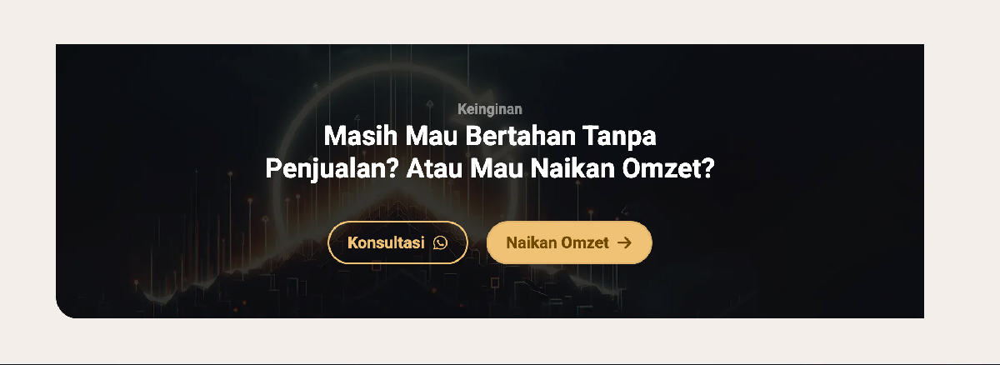

# 📣 Spesifikasi: ExalviaCTA1

Section Call-to-Action (CTA) pertama yang dirancang untuk memberikan dorongan emosional yang kuat kepada pengunjung untuk segera mengambil tindakan.

**Implementasi:** [ExalviaCTA1.js](../../sections/ExalviaCTA1.js)

---

## 🏗️ Tata Letak & Perilaku (Layout & Behavior)

- **Layout Style:** Full width dengan kontainer dalam yang elegan.
- **Background:** Menggunakan warna gelap (`bg-neutral` atau hitam premium) untuk menciptakan kontras maksimal dengan section lainnya.
- **Rounding:** Menggunakan standar arsitektural kita: `rounded-bl-4xl`.
- **Container Size:** `lg:w-10/12 sm:w-11/12 w-full mx-auto`.
- **Alignment:** Rata tengah (_Centered_) secara horizontal dan vertikal.
- **Padding:** `py-24 md:py-32`.

---

## 🍱 Struktur Konten (CTA Section Structure)

Data diambil dari objek `cta1` di `ExalviaDatabase.js`:

1.  **Label:** Teks kecil "Keinginan" atau label aksi di atas headline menggunakan font `Montserrat`.
2.  **Headline:**
    - Judul yang provokatif dan persuasif (misal: "Masih Mau Bertahan Tanpa Penjualan?").
    - Tipografi: `Instrument Serif` atau `Montserrat` bold.
    - Warna: Putih bersih.
3.  **CTA Buttons Area:**
    - **Primary Button:** Tombol solid (`btn-warning`) dengan ikon panah.
    - **WhatsApp Button:** Tombol outline (`btn-outline`) warna emas dengan ikon WhatsApp.
    - Gaya: Responsive (`w-full sm:w-auto`).

---

## 🛠️ Instruksi Teknis untuk AI

1.  **High Contrast UX:** Pastikan background sangat gelap agar tombol `warning` (emas) terlihat sangat menonjol (_pop out_).
2.  **No Blur Policy:** Gunakan solid background atau subtle gradient. Jangan gunakan blur pada area tombol atau latar belakang.
3.  **Atomic Usage:** Wajib menggunakan `ExalviaLinkButton` untuk kedua tombol.
4.  **Database Binding:** Hubungkan headline, label, dan link WhatsApp langsung ke database.

---

## 📸 Referensi Visual

