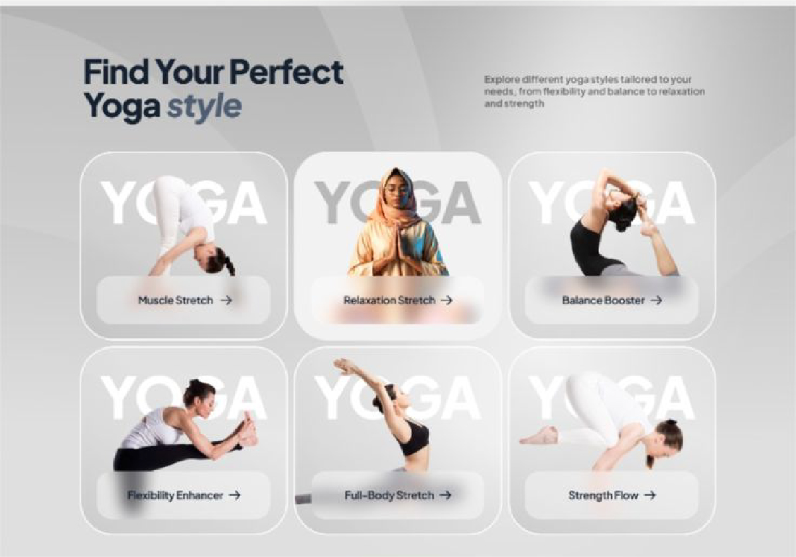

# 🚀 Spesifikasi: ExalviaFeatures

Section ini memvisualisasikan fitur-fitur unggulan atau kategori layanan dengan gaya galeri yang modern dan imersif.

**Implementasi:** [ExalviaFeatures.js](../../sections/ExalviaFeatures.js)

---

## 🏗️ Tata Letak & Perilaku (Layout & Behavior)

- **Header Section:**
  - Menggunakan `ExalviaSectionHeader` (Badge + Headline + SubHeadline).
  - Penempatan: Desktop Side-by-Side (Headline di kiri, SubHeadline di kanan) atau Centered.
- **Features Grid:**
  - **Desktop:** Grid 3-kolom (`grid-cols-3`).
  - **Mobile:** Grid 1 atau 2 kolom bergantian.
- **Container Size:** `lg:w-10/12 sm:w-11/12 w-full mx-auto`.
- **Architectural Style:**
  - Padding luas: `py-20 md:py-32`.
  - Spacing antar kartu: `gap-6`.

---

## 🍱 Struktur Konten (Features Section Structure)

Data diambil dari objek `features` di `ExalviaDatabase.js`:

### 1. Feature Card (Individual Item)

- **Background:** Setiap kartu menggunakan gambar latar belakang penuh (`data.items[].image`).
- **Overlay:** Lapisan gelap atau gradasi tipis di bagian bawah kartu untuk memastikan keterbacaan label.
- **Label Area:**
  - Teks: Judul fitur (`data.items[].title`).
  - Ikon: Aksen panah atau plus (`FaArrowRight` atau serupa).
  - Gaya: Blur murni (DILARANG), gunakan semi-transparent solid background (`bg-base-100/90` atau `bg-black/40`).
- **Hover Effect:** Kartu membesar sedikit (_scale-105_) atau kontras gambar meningkat saat diarahkan kursor.

---

## 🛠️ Instruksi Teknis untuk AI

1.  **Image Layering:** Gunakan `next/image` dengan `object-cover` di dalam kontainer kartu yang memiliki `aspect-square` atau `aspect-[4/5]`.
2.  **No Blur Policy:** Gunakan background solid dengan opacity (`opacity-90`) untuk area label. Jangan gunakan `backdrop-blur`.
3.  **Atomic Usage:** Wajib menggunakan `ExalviaSectionHeader` untuk bagian judul utama.
4.  **Database Binding:** Seluruh konten (Judul, Subjudul, Gambar Item, Label Item) wajib dimuat dari properti `features` di database.

---

## 📸 Referensi Visual

