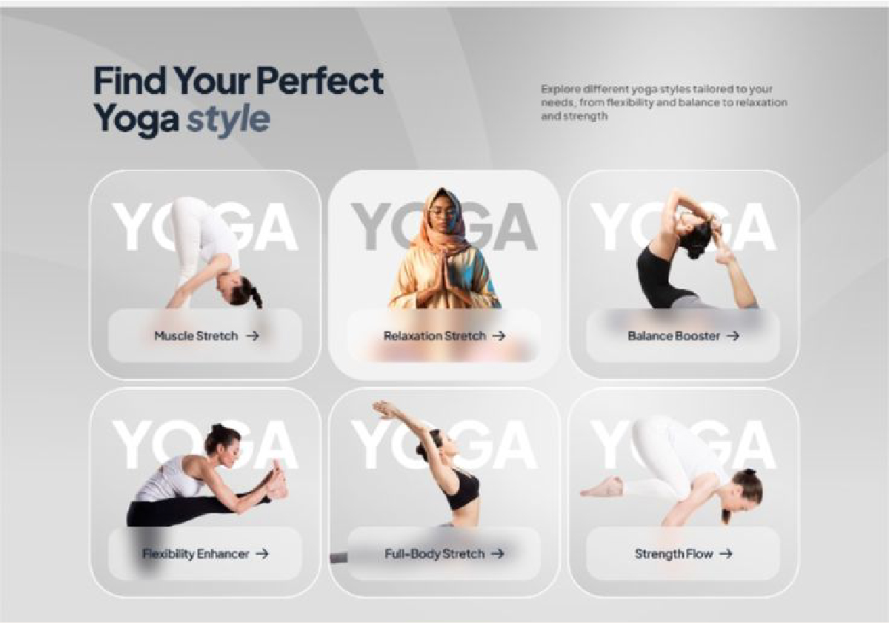

# 🔄 Spesifikasi: ExalviaFlow

Section ini memvisualisasikan alur atau fase kerja yang akan dilalui klien saat memesan jasa copywriting di Exalvia.

**Implementasi:** [ExalviaFlow.js](../../sections/ExalviaFlow.js)

---

## 🏗️ Tata Letak & Perilaku (Layout & Behavior)

- **Header Section:** Centered Header menggunakan `ExalviaSectionHeader`.
- **Flow Grid:**
  - **Desktop:** Grid 3-kolom (`grid-cols-3`) berurutan.
  - **Mobile:** Tumpukan vertikal dengan garis penghubung opsional.
- **Container Size:** `lg:w-10/12 sm:w-11/12 w-full mx-auto`.
- **Architectural Style:**
  - Padding luas: `py-20 md:py-32`.
  - Gunakan elemen **penghubung** (garis tipis atau panah) antar langkah pada desktop untuk memperjelas alur.

---

## 🍱 Struktur Konten (Flow Section Structure)

Data diambil dari objek `flow` di `ExalviaDatabase.js`:

### 1. Flow Step Card

- **Numeric Identity:** Angka urutan besar (`01`, `02`, dst) sebagai latar belakang transparan atau aksen di pojok.
- **Image/Visual:** Ilustrasi atau foto kecil yang relevan dengan tahap kerja (`data.items[].image`).
- **Narration:**
  - **Title:** Judul tahap kerja (misal: "Riset Audiens").
  - **Description:** Penjelasan detail mengenai apa yang dilakukan di tahap tersebut.
- **Styling:**
  - Basis: `ExalviaCard`.
  - Border: Subtle border yang hanya muncul atau menebal saat hover.
  - Layout: Konten rata tengah atau rata kiri tergantung keseimbangan visual.

---

## 🛠️ Instruksi Teknis untuk AI

1.  **Sequence Logic:** Pastikan alur nomor terbaca logis (kiri ke kanan, atas ke bawah).
2.  **Atomic Consistency:** Wajib menggunakan `ExalviaCard`, `ExalviaHeadline`, dan `ExalviaBodyText`.
3.  **No Blur Policy:** Fokus pada tipografi yang kuat dan kejelasan icon/image.
4.  **Database Binding:** Hubungkan semua teks, gambar, dan nomor urut ke database.

---

## 📸 Referensi Visual

