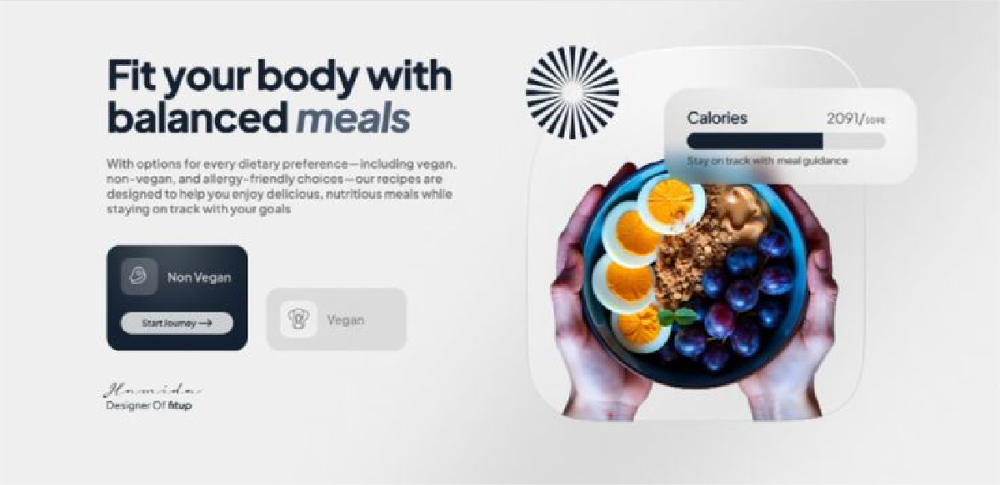

# 🛠️ Spesifikasi: ExalviaHowItWork

Section ini menjelaskan proses atau alur kerja layanan secara visual dan terstruktur, memberikan kejelasan langkah-langkah kepada calon klien.

**Implementasi:** [ExalviaHowItWork.js](../../sections/ExalviaHowItWork.js)

---

## 🏗️ Tata Letak & Perilaku (Layout & Behavior)

- **Grid System:**
  - **Desktop:** Layout 2-kolom (`grid-cols-2`).
  - **Mobile:** Layout tumpuk (`flex-col`).
- **Container Style:** Menggunakan kontainer lebar dengan rounding arsitektural: `lg:w-10/12 sm:w-11/12 w-full mx-auto rounded-bl-4xl`.
- **Vertical Alignment:** Elemen di dalam kolom wajib rata tengah secara vertikal (`items-center`).
- **Efek Visual:**
  - **Wajib:** Menggunakan transisi halus pada hover.
  - **Larangan:** Dilarang menggunakan efek blur atau glassmorphism.

---

## 🍱 Struktur Konten (How It Works Structure)

Section ini dibagi menjadi dua area utama:

### 1. Kolom Kiri: Narasi & List Langkah

- **Section Label:** Menggunakan `ExalviaBadge`.
- **Headline:** Menampilkan judul section menggunakan `ExalviaHeadline`.
- **SubHeadline/Body:** Penjelasan singkat menggunakan `ExalviaSubHeadline`.
- **Process List:**
  - Loop data dari `ExalviaDatabase.js`.
  - Setiap poin terdiri dari **Nomor Urut**, **Judul Langkah**, dan **Deskripsi Singkat**.
  - Gunakan ikon atau elemen visual minimalis untuk membedakan antar langkah.

### 2. Kolom Kanan: Visual Pendukung

- **Image Wrapper:** Menggunakan `ExalviaImage` untuk menampilkan ilustrasi atau foto proses kerja.
- **Ratio:** Pastikan gambar memiliki aspek rasio yang seimbang (misal: `aspect-[4/3]`).
- **Decoration:** Bisa ditambahkan pola Arabesque tipis di belakang gambar sebagai lapisan estetika.

---

## 🛠️ Instruksi Teknis untuk AI

1.  **Data Binding:** Ambil array data proses dari objek `howItWork` di `ExalviaDatabase.js`.
2.  **Atomic Usage:** Wajib menggunakan `ExalviaSectionHeader` untuk bagian judul agar konsisten dengan section lain.
3.  **Animation:** Implementasikan animasi `fade-in-up` sederhana saat section masuk ke viewport (opsional namun disarankan).
4.  **Responsive Padding:** Gunakan `py-20 md:py-32` untuk memberikan ruang nafas yang mewah.

---

## 📸 Referensi Visual

