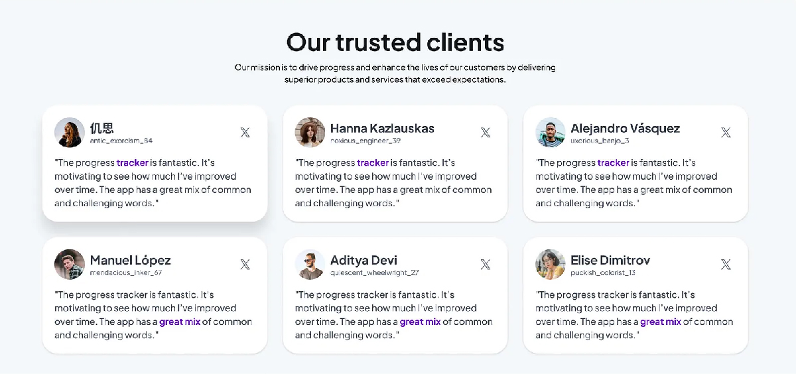

# 💬 Spesifikasi: ExalviaTestimonials

Section bukti sosial yang menampilkan testimoni dari klien terdahulu untuk menghapus keraguan calon pelanggan dan memperkuat kepercayaan.

**Implementasi:** [ExalviaTestimonials.js](../../sections/ExalviaTestimonials.js)

---

## 🏗️ Tata Letak & Perilaku (Layout & Behavior)

- **Header Section:** Centered Header menggunakan `ExalviaSectionHeader`.
- **Testimonial Grid:**
  - **Desktop:** Grid 3-kolom (`grid-cols-3`).
  - **Mobile:** Tumpukan vertikal atau Slider/Carousel.
- **Container Size:** `lg:w-10/12 sm:w-11/12 w-full mx-auto`.
- **Architectural Style:**
  - Padding luas: `py-20 md:py-32`.
  - Spacing antar kartu: `gap-6`.

---

## 🍱 Struktur Konten (Testimonials Section Structure)

Data diambil dari objek `testimonials` di `ExalviaDatabase.js`:

### 1. Testimonial Card (ExalviaCard based)

- **Top Section (User Info):**
  - **Avatar:** Foto klien (`rounded-full`) di sisi kiri.
  - **Metadata:** Nama klien (Bold) dan Role/Business (Gray, small) di samping avatar.
  - **Social Icon:** Aksen ikon platform (misal: ikon X/Twitter atau Instagram) di pojok kanan atas untuk menambah keaslian.
- **Content Section:**
  - **Quote Text:** Teks testimoni yang jujur dan persuasif. Tipografi: `Montserrat` dengan line-height yang nyaman.
  - **Highlight:** Bisa ditambahkan penebalan pada kata-kata kunci dalam testimoni.

---

## 🛠️ Instruksi Teknis untuk AI

1.  **Masonry or Equal Height:** Gunakan `grid` dengan tinggi kartu yang sama atau Masonry layout untuk estetika yang lebih organik.
2.  **Atomic Consistency:** Wajib menggunakan `ExalviaCard`, `ExalviaRating` (opsional), dan `ExalviaBodyText`.
3.  **No Blur Policy:** Fokus pada kebersihan kartu dan tipografi yang kontras.
4.  **Database Binding:** Hubungkan semua data avatar, nama, role, dan teks testimoni ke database.

---

## 📸 Referensi Visual

