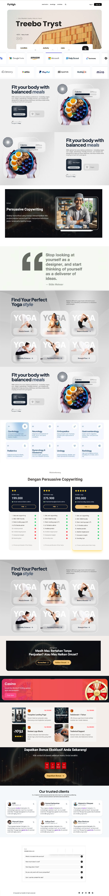

# 🎨 Panduan Desain & Pengembangan Landing Page Exalvia

Dokumen ini adalah referensi tunggal (single source of truth) untuk estetika, teknologi, dan aturan pengembangan bagi AI Developer yang mengerjakan template Exalvia.

---

## 📸 Referensi Visual (Inspirasi)

### Estetika Umum & Layout



### Palet Warna & Suasana


### Layout Hero Section


---

## 🤖 Instruksi Pengembang AI (Developer Guidelines)

Patuhi aturan berikut secara ketat untuk menjaga kualitas dan konsistensi:

### 1. Teknologi (Stack Dasar)

- **Styling:** Tailwind CSS (untuk layout & kustomisasi).
- **UI Library:** DaisyUI (untuk komponen standar seperti button, badge, accordion).
- **Ikon:** React Icons (pilih library yang relevan seperti `lucide`, `fa`).

### 2. Aturan Data (Database First)

- **Sumber Data:** Semua konten tekstual, URL gambar, dan data ikon **WAJIB** berada di dalam file `src/app/bonus/landingpageTemplate/exalvia/database/ExalviaDatabase.js`.
- **Dilarang Hardcoding:** Jangan menulis teks panjang atau URL gambar langsung di file komponen.
- **Pengecualian:** Parameter `secId` dan teks singkat pada label tombol boleh didefinisikan secara lokal di komponen jika diperlukan.

### 3. Sistem Desain & Estetika (Islamic Premium)

- **Konsep:** Minimalis, modern, bersih, dengan sentuhan dekorasi Islami (Arab ornamen/pattern) yang halus dan elegan.
- **Tipografi:**
  - **Headlines/Judul:** Menggunakan font `Instrument Serif`.
  - **Body Text:** Menggunakan font `Montserrat`.
- **Warna:**
  - Wajib mendukung mode **Light/Dark** dari DaisyUI.
  - Elemen CTA: Wajib menggunakan kelas `btn-warning` dari DaisyUI.
  - **Larangan Efek:** DILARANG menggunakan efek blur atau `backdrop-filter` di seluruh bagian halaman.
- **Visual Aset:** Gunakan gambar berkualitas tinggi dari internet (Pexels/Unsplash). Manfaatkan _white space_ (ruang kosong) yang luas untuk kesan mewah.
- **Responsivitas:** Wajib _Mobile-first_. Desktop menggunakan layout side-by-side, Mobile menggunakan layout stack bertumpuk.

### 4. Struktur Kode (Blueprints)

Setiap komponen section harus mengikuti pola ini agar navigasi (scroll) dan data binding berjalan sempurna:

```javascript
import React from "react";

export default function NamaSection({ data, secId }) {
  return (
    <section id={secId} className="sm:p-10 p-5">
      <div className="container lg:w-10/12 w-full mx-auto">
        {/* Implementasi layout Tailwind & DaisyUI di sini */}
        {/* Contoh: <h2 className="font-instrument-serif text-4xl">{data.title}</h2> */}
      </div>
    </section>
  );
}
```
